```mermaid
graph TB
    subgraph "Kubernetes Cluster"
        K8S_API[Kubernetes API Server]
        GWC[GatewayClass CRD]
        GW[Gateway CRD]
        HR[HTTPRoute CRD]
        GR[GRPCRoute CRD]
        IP[InferencePool CRD]
        SEC[Secrets]
        SVC[Services]
    end

    subgraph "Kubvernor Control Plane"
        subgraph "Controllers Layer"
            GWC_CTRL[GatewayClass Controller]
            GW_CTRL[Gateway Controller]
            HR_CTRL[HTTPRoute Controller]
            GR_CTRL[GRPCRoute Controller]
            IP_CTRL[InferencePool Controller]
        end

        subgraph "Services Layer"
            GW_DEPLOYER[Gateway Deployer Service]
            REF_VALIDATOR[Reference Validator Service]

            subgraph "Patchers"
                GWC_PATCHER[GatewayClass Patcher]
                GW_PATCHER[Gateway Patcher]
                HR_PATCHER[HTTPRoute Patcher]
                GR_PATCHER[GRPCRoute Patcher]
                IP_PATCHER[InferencePool Patcher]
            end
        end

        STATE[(In-Memory State)]

        subgraph "Reference Resolvers"
            SEC_RESOLVER[Secrets Resolver]
            BACKEND_RESOLVER[Backend Reference Resolver]
            GRANT_RESOLVER[Reference Grants Resolver]
        end

        subgraph "Backend Deployers"
            ENVOY_DEPLOYER[Envoy xDS Backend]
            AGENT_DEPLOYER[Agentgateway Backend]
        end
    end

    subgraph "Data Plane Gateways"
        ENVOY_GW[Envoy Gateway]
        AGENT_GW[Agentgateway]
    end

    %% Kubernetes API interactions
    K8S_API -->|Watch| GWC
    K8S_API -->|Watch| GW
    K8S_API -->|Watch| HR
    K8S_API -->|Watch| GR
    K8S_API -->|Watch| IP

    %% Controller watches
    GWC -->|Events| GWC_CTRL
    GW -->|Events| GW_CTRL
    HR -->|Events| HR_CTRL
    GR -->|Events| GR_CTRL
    IP -->|Events| IP_CTRL

    %% Controllers to State
    GWC_CTRL -->|Store| STATE
    GW_CTRL -->|Store| STATE
    HR_CTRL -->|Store| STATE
    GR_CTRL -->|Store| STATE
    IP_CTRL -->|Store| STATE

    %% Controllers to Services
    GW_CTRL -->|Deploy Request| GW_DEPLOYER
    HR_CTRL -->|Validate Refs| REF_VALIDATOR
    GR_CTRL -->|Validate Refs| REF_VALIDATOR
    IP_CTRL -->|Validate Refs| REF_VALIDATOR

    %% Reference Resolvers
    REF_VALIDATOR -->|Resolve Secrets| SEC_RESOLVER
    REF_VALIDATOR -->|Resolve Backends| BACKEND_RESOLVER
    REF_VALIDATOR -->|Check Grants| GRANT_RESOLVER

    SEC_RESOLVER -->|Fetch| SEC
    BACKEND_RESOLVER -->|Fetch| SVC
    GRANT_RESOLVER -->|Query| STATE

    %% Gateway Deployer to Backends
    GW_DEPLOYER -->|xDS Config| ENVOY_DEPLOYER
    GW_DEPLOYER -->|Config| AGENT_DEPLOYER

    %% Backends to Gateways
    ENVOY_DEPLOYER -->|gRPC/xDS| ENVOY_GW
    AGENT_DEPLOYER -->|gRPC| AGENT_GW

    %% Backend responses
    ENVOY_DEPLOYER -->|Status| GW_DEPLOYER
    AGENT_DEPLOYER -->|Status| GW_DEPLOYER

    %% Patchers update Kubernetes
    GW_DEPLOYER -->|Patch| GW_PATCHER
    GW_DEPLOYER -->|Patch| HR_PATCHER
    GW_DEPLOYER -->|Patch| GR_PATCHER

    GWC_PATCHER -->|Update Status| K8S_API
    GW_PATCHER -->|Update Status| K8S_API
    HR_PATCHER -->|Update Status| K8S_API
    GR_PATCHER -->|Update Status| K8S_API
    IP_PATCHER -->|Update Status| K8S_API

    %% Data flow from clients
    CLIENTS[Clients] -->|HTTP/gRPC Traffic| ENVOY_GW
    CLIENTS -->|HTTP/gRPC Traffic| AGENT_GW
    ENVOY_GW -->|Route to| SVC
    AGENT_GW -->|Route to| SVC

    style STATE fill:#f9f,stroke:#333,stroke-width:4px
    style GW_DEPLOYER fill:#bbf,stroke:#333,stroke-width:2px
    style REF_VALIDATOR fill:#bbf,stroke:#333,stroke-width:2px
    style ENVOY_GW fill:#bfb,stroke:#333,stroke-width:2px
    style AGENT_GW fill:#bfb,stroke:#333,stroke-width:2px
```

# Kubvernor Architecture

Kubvernor is a Rust implementation of Kubernetes Gateway API that acts as a generic control plane for managing different gateway implementations (Envoy, Agentgateway, etc.). It provides a Kubernetes-native way to configure and manage API gateways using standard Gateway API resources.

## Table of Contents

1. [Overview](#overview)
2. [High-Level Architecture](#high-level-architecture)
3. [Core Components](#core-components)
4. [Data Flow](#data-flow)
5. [Communication Patterns](#communication-patterns)
6. [State Management](#state-management)
7. [Reference Resolution](#reference-resolution)
8. [Backend Integration](#backend-integration)
9. [Reconciliation Loop](#reconciliation-loop)
10. [Extension Points](#extension-points)

## Overview

Kubvernor implements a control plane that:
- Watches Kubernetes Gateway API resources (GatewayClass, Gateway, HTTPRoute, GRPCRoute)
- Validates cross-resource references (Services, Secrets, ReferenceGrants)
- Translates Gateway API configurations to backend-specific formats (xDS for Envoy)
- Serves configurations to data plane gateways via gRPC
- Updates resource statuses to reflect the current state

### Key Design Principles

1. **Generic Backend Support**: Abstract interface allows plugging different gateway implementations
2. **Asynchronous Architecture**: All components communicate via channels for non-blocking operations
3. **Event-Driven**: React to Kubernetes resource changes and propagate updates through the system
4. **In-Memory State**: Fast lookups with centralized state cache
5. **Reference Validation**: Comprehensive cross-resource dependency checking

## High-Level Architecture



See [ARCHITECTURE_DIAGRAMS.md](ARCHITECTURE_DIAGRAMS.md) for detailed per-module diagrams.

## Core Components

### Controllers Layer

Controllers implement the Kubernetes controller pattern, watching for resource changes and triggering reconciliation loops.

#### GatewayClass Controller
**Location**: `src/controllers/gateway_class.rs`

**Responsibilities**:
- Watches GatewayClass resources
- Validates controller name matches Kubvernor's configured name
- Updates GatewayClass status with Accepted condition
- Stores GatewayClass in shared state
- Manages finalizers for cleanup

**Key Operations**:
- Accepts GatewayClass if `spec.controllerName` matches
- Extracts backend configuration from `spec.parametersRef`
- Adds finalizer to prevent deletion while Gateways exist

#### Gateway Controller
**Location**: `src/controllers/gateway.rs`

**Responsibilities**:
- Watches Gateway resources
- Validates Gateway references GatewayClass managed by Kubvernor
- Extracts backend type from GatewayClass configuration
- Initiates gateway deployment process
- Manages Gateway lifecycle (create, update, delete)

**Key Operations**:
- Validates Gateway's `spec.gatewayClassName`
- Determines backend type (Envoy, Agentgateway) from KubvernorConfig
- Sends deployment requests to appropriate backend
- Handles finalizer management for cleanup

#### HTTPRoute Controller
**Location**: `src/controllers/route/http_route.rs`

**Responsibilities**:
- Watches HTTPRoute resources
- Validates parent Gateway references
- Resolves backend Service references
- Attaches routes to matching Gateway listeners
- Updates route status conditions

**Key Operations**:
- Matches routes to Gateway listeners based on hostname and protocol
- Validates HTTPRoute rules and filters
- Resolves Service backends
- Triggers Gateway redeployment when routes change

#### GRPCRoute Controller
**Location**: `src/controllers/route/grpc_route.rs`

**Responsibilities**:
- Watches GRPCRoute resources
- Similar to HTTPRoute but for gRPC traffic
- Validates gRPC-specific routing rules

**Key Operations**:
- Matches routes to Gateway listeners with gRPC protocol
- Validates GRPCRoute rules
- Resolves Service backends
- Triggers Gateway redeployment when routes change

#### InferencePool Controller
**Location**: `src/controllers/inference_pool.rs`

**Responsibilities**:
- Watches InferencePool resources (Gateway API Inference Extension)
- Manages AI/ML model serving endpoints
- Validates endpoint configurations
- Updates InferencePool status

**Key Operations**:
- Watches for InferencePool changes
- Resolves inference backend endpoints
- Updates status with endpoint availability

### Services Layer

Services provide centralized business logic and orchestration.

#### Gateway Deployer Service
**Location**: `src/services/gateway_deployer/mod.rs`

**Responsibilities**:
- Orchestrates gateway deployment to backends
- Receives deployment requests from controllers
- Sends configuration to appropriate backend deployers
- Handles backend responses
- Triggers status updates via patchers

**Message Flow**:
1. Receives `GatewayDeployRequest::Deploy` from controllers
2. Routes to appropriate backend deployer (Envoy/Agentgateway)
3. Receives `BackendGatewayResponse` from backend
4. Processes response and updates gateway state
5. Sends status patch operations to patchers

**Channel Communication**:
- **Input**: `gateway_deployer_channel_receiver` - Deploy requests
- **Output**: `backend_deployer_channel_senders` - Backend-specific events
- **Input**: `backend_response_channel_receiver` - Backend responses
- **Output**: Patcher channels - Status updates

#### Reference Validator Service
**Location**: `src/services/reference_resolver/mod.rs`

**Responsibilities**:
- Validates cross-resource references
- Coordinates with reference resolvers
- Processes gateway and route reference changes
- Triggers gateway redeployment when dependencies change

**Validation Types**:
1. **Secret References**: TLS certificates for HTTPS listeners
2. **Service References**: Backend services for routing
3. **InferencePool References**: AI/ML backends
4. **Reference Grants**: Cross-namespace reference permissions

**Message Flow**:
1. Receives `ReferenceValidateRequest` events
2. Dispatches to appropriate resolver (Secrets, Backend, ReferenceGrants)
3. Validates references exist and are accessible
4. Updates affected gateways when references change
5. Triggers redeployment if needed

#### Patcher Services
**Location**: `src/services/patchers/`

**Responsibilities**:
- Update Kubernetes resource status subresources
- Apply finalizers to resources
- Handle deletion with cleanup
- Asynchronous Kubernetes API operations

**Patcher Types**:
- **GatewayClass Patcher**: Updates GatewayClass status
- **Gateway Patcher**: Updates Gateway status with listener/address info
- **HTTPRoute Patcher**: Updates HTTPRoute parent status
- **GRPCRoute Patcher**: Updates GRPCRoute parent status
- **InferencePool Patcher**: Updates InferencePool status

**Operation Types**:
```rust
pub enum Operation<R> {
    PatchStatus(PatchContext<R>),     // Update status subresource
    PatchFinalizer(FinalizerContext),  // Add/remove finalizer
    Delete(DeleteContext<R>),          // Delete with cleanup
}
```

### Reference Resolvers

Reference resolvers watch Kubernetes resources and track dependencies.

#### Secrets Resolver
**Location**: `src/common/references_resolver/secrets_resolver/`

**Responsibilities**:
- Watches Secret resources
- Tracks which Gateways reference which Secrets
- Validates Secret format (TLS certificates)
- Notifies affected Gateways when Secrets change

**Implementation**:
- Maintains reverse index: Secret → [Gateways]
- Validates certificate format and expiration
- Checks ReferenceGrants for cross-namespace access

#### Backend Reference Resolver
**Location**: `src/common/references_resolver/backends_resolver.rs`

**Responsibilities**:
- Watches Service resources
- Watches InferencePool resources
- Tracks route → backend mappings
- Resolves backend endpoints and ports
- Notifies affected Gateways when backends change

**Implementation**:
- Maintains reverse index: Service/InferencePool → [Routes] → [Gateways]
- Resolves endpoints for load balancing
- Validates port mappings

#### Reference Grants Resolver
**Location**: `src/common/references_resolver/reference_grants_resolver.rs`

**Responsibilities**:
- Watches ReferenceGrant resources
- Validates cross-namespace references
- Checks if references are permitted

**Implementation**:
- Maintains index of ReferenceGrants
- Validates `from` and `to` namespace matches
- Checks resource kind and name filters

### Backend Deployers

Backend deployers translate Gateway API to backend-specific configurations.

#### Envoy xDS Backend
**Location**: `src/backends/envoy/envoy_xds_backend/`

**Responsibilities**:
- Implements Envoy Aggregated Discovery Service (ADS)
- Translates Gateway API to xDS resources
- Serves xDS configuration via gRPC
- Manages snapshot versions
- Handles Envoy gateway connections

**xDS Resources Generated**:
- **Listeners (LDS)**: Gateway listeners with filters
- **Clusters (CDS)**: Backend service clusters
- **Routes (RDS)**: HTTP/gRPC routing rules (referenced from listeners)
- **Endpoints (EDS)**: Service endpoint addresses (optional)

**Implementation Details**:
- Maintains per-gateway xDS snapshots
- Tracks client connections and versions
- Incremental updates on configuration changes
- Implements snapshot cache for consistency

**Files**:
- `server.rs`: gRPC ADS server implementation
- `envoy_deployer.rs`: Receives gateway configs, generates xDS
- `resources.rs`: xDS resource generation
- `route_converters/`: HTTP/gRPC to xDS route conversion

#### Agentgateway Backend
**Location**: `src/backends/agentgateway/`

**Responsibilities**:
- Translates Gateway API to Agentgateway format
- Serves configuration via gRPC
- Manages Agentgateway connections

**Implementation**:
- Similar pattern to Envoy backend
- Custom protocol for Agentgateway
- Feature-flagged (`agentgateway` feature)

## Data Flow

### Gateway Creation Flow

```
User creates Gateway
    ↓
Kubernetes API Server persists Gateway
    ↓
Gateway Controller receives watch event
    ↓
Gateway Controller validates GatewayClass
    ↓
Gateway Controller determines backend type
    ↓
Gateway Controller stores Gateway in State
    ↓
Gateway Controller sends ReferenceValidateRequest
    ↓
Reference Validator Service processes request
    ↓
Reference Validator resolves Secrets (TLS certificates)
    ↓
Reference Validator resolves Routes (HTTPRoutes attached)
    ↓
Reference Validator sends GatewayDeployRequest
    ↓
Gateway Deployer Service routes to backend
    ↓
Backend Deployer generates configuration (xDS/custom)
    ↓
Backend Deployer sends configuration to data plane
    ↓
Data plane gateway receives and applies config
    ↓
Backend Deployer sends BackendGatewayResponse
    ↓
Gateway Deployer processes response
    ↓
Gateway Deployer sends PatchStatus to Gateway Patcher
    ↓
Gateway Patcher updates Gateway status in Kubernetes
    ↓
Gateway status shows "Programmed" condition = True
```

### Route Attachment Flow

```
User creates HTTPRoute
    ↓
HTTPRoute Controller receives watch event
    ↓
HTTPRoute Controller validates parent Gateway references
    ↓
HTTPRoute Controller matches route to Gateway listeners
    ↓
HTTPRoute Controller stores route in State
    ↓
HTTPRoute Controller attaches route to Gateway in State
    ↓
HTTPRoute Controller sends ReferenceValidateRequest
    ↓
Reference Validator resolves backend Services
    ↓
Reference Validator checks ReferenceGrants
    ↓
Reference Validator triggers Gateway redeployment
    ↓
Gateway Deployer receives updated Gateway with routes
    ↓
Backend Deployer generates updated xDS with routes
    ↓
Data plane receives updated configuration
    ↓
HTTPRoute status updated with parent Gateway status
```

### Backend Service Change Flow

```
Service endpoints change (Pod scaling)
    ↓
Backend Reference Resolver watches Service
    ↓
Backend Reference Resolver finds affected Routes
    ↓
Backend Reference Resolver finds affected Gateways
    ↓
Reference Validator sends UpdatedGateways event
    ↓
Gateway Deployer redeploys affected Gateways
    ↓
Backend Deployer generates updated xDS with new endpoints
    ↓
Data plane receives updated endpoint configuration
    ↓
Traffic is routed to new backend endpoints
```

## Communication Patterns

### Asynchronous Channels

All components communicate via Tokio mpsc channels for non-blocking operation.

**Channel Types**:
- `gateway_deployer_channel`: Deploy requests → Gateway Deployer
- `reference_validate_channel`: Reference validation → Reference Validator
- `backend_deployer_channels`: Backend-specific events (per backend type)
- `patcher_channels`: Status updates → Patchers (per resource type)
- `backend_response_channel`: Backend responses → Gateway Deployer

**Benefits**:
- Non-blocking operations
- Natural backpressure via channel capacity
- Decoupled components
- Easy to test individual components

### Synchronous State Access

State is accessed synchronously via Mutex-protected HashMap.

**State Access Pattern**:
```rust
let gateway = state.get_gateway(&resource_key)
    .expect("We expect the lock to work");
```

**Trade-offs**:
- Fast reads (in-memory)
- Mutex contention on high traffic
- Simple programming model

### Kubernetes API Calls

Controllers use Kubernetes client for:
- **Watch**: Streaming resource changes
- **Get**: Fetch individual resources
- **Patch**: Update resource status/metadata

**Patterns**:
- Controllers watch all namespaces (`Api::all`)
- Patchers use apply patches with server-side apply
- Finalizers use strategic merge patch

## State Management

### In-Memory State

**Location**: `src/state.rs`

**Contents**:
```rust
pub struct State {
    gateway_classes: Arc<Mutex<HashMap<ResourceKey, Arc<GatewayClass>>>>,
    gateways: Arc<Mutex<HashMap<ResourceKey, Arc<Gateway>>>>,
    http_routes: Arc<Mutex<HashMap<ResourceKey, Arc<HTTPRoute>>>>,
    grpc_routes: Arc<Mutex<HashMap<ResourceKey, Arc<GRPCRoute>>>>,
    gateways_with_routes: Arc<Mutex<HashMap<ResourceKey, BTreeSet<ResourceKey>>>>,
    inference_pools: Arc<Mutex<HashMap<ResourceKey, Arc<InferencePool>>>>,
    gateway_implementation_types: Arc<Mutex<HashMap<ResourceKey, GatewayImplementationType>>>,
}
```

**Key Methods**:
- `save_gateway()`: Store gateway
- `get_gateway()`: Retrieve gateway
- `attach_http_route_to_gateway()`: Create route-gateway mapping
- `get_http_routes_attached_to_gateway()`: Get all routes for gateway
- `save_gateway_type()`: Store backend implementation type

**Synchronization**:
- Each field is independently locked
- Multiple readers can access different fields concurrently
- Arc enables cheap cloning across threads

### Resource Key

**Location**: `src/common/resource_key.rs`

Unique identifier for Kubernetes resources:
```rust
pub struct ResourceKey {
    pub name: String,
    pub namespace: String,
    pub kind: String,
}
```

Used as HashMap keys for efficient lookups.

## Reference Resolution

### Secret Resolution

**Purpose**: Validate TLS certificates for HTTPS listeners

**Process**:
1. Gateway references Secret in listener TLS config
2. Secrets Resolver watches Secret resources
3. Validates Secret exists and has correct format
4. Checks ReferenceGrant for cross-namespace access
5. Marks certificate as Resolved/NotResolved/Invalid
6. Notifies Gateway when Secret changes

**Conditions Updated**:
- `ResolvedRefs`: True if all secrets resolved
- `InvalidCertificateRef`: True if secret format invalid

### Backend Resolution

**Purpose**: Resolve Service endpoints for routing

**Process**:
1. Route references Service in backend
2. Backend Resolver watches Service resources
3. Resolves Service cluster IP and port
4. Checks ReferenceGrant for cross-namespace access
5. Marks backend as Resolved/Unresolved/NotAllowed
6. Notifies Gateway when Service changes

**InferencePool Resolution**:
- Similar process for InferencePool backends
- Extracts endpoint picker configuration
- Resolves target ports for model serving

### Reference Grant Validation

**Purpose**: Enable secure cross-namespace references

**Process**:
1. Route/Gateway references resource in different namespace
2. Reference Grants Resolver checks for matching ReferenceGrant
3. Validates `from` namespace matches referrer
4. Validates `to` namespace matches referee
5. Validates resource kind and name match grant

## Backend Integration

### xDS Protocol (Envoy)

**Protocol**: Envoy Aggregated Discovery Service (ADS)

**Flow**:
1. Envoy gateway connects to Kubvernor gRPC server
2. Sends DiscoveryRequest with node ID (gateway name/namespace)
3. Kubvernor matches request to Gateway resource
4. Generates xDS snapshot (Listeners + Clusters)
5. Sends DiscoveryResponse with configuration
6. Envoy applies configuration
7. Envoy sends ACK or NACK
8. Kubvernor updates snapshot version

**Update Triggers**:
- Gateway configuration changes
- Route addition/removal/modification
- Backend Service changes
- Secret updates (TLS certificates)

### Custom Protocol (Agentgateway)

**Protocol**: Custom gRPC-based configuration

**Implementation**:
- Similar channel-based architecture
- Custom resource generation
- Feature-flagged for optional inclusion

## Reconciliation Loop

### Controller Pattern

Each controller implements Kubernetes controller pattern:

```rust
Controller::new(Api::all(client), Config::default())
    .run(Self::reconcile, Self::error_policy, context)
```

**Reconcile Function**:
1. Receives resource change event (Create/Update/Delete)
2. Validates resource
3. Checks finalizers
4. Processes business logic
5. Returns Action (Requeue/RequeueAfter)

**Error Policy**:
- Determines retry behavior on errors
- Different requeue times for different error types
- Exponential backoff for transient errors

### Startup Sequence

**Timing**:
```rust
const STARTUP_DURATION: Duration = Duration::from_secs(10);

// GatewayClass Controller: Immediate
// Gateway Controller: +10 seconds
// Route Controllers: +20 seconds
// InferencePool Controller: +20 seconds
```

**Rationale**:
- Ensure GatewayClasses are loaded before Gateways
- Ensure Gateways are loaded before Routes
- Avoid thundering herd on startup

## Extension Points

### Custom Gateway Implementations

**Interface**: `BackendGatewayEvent` + `BackendGatewayResponse`

**Steps to Add New Backend**:
1. Create new module in `src/backends/`
2. Implement deployer service receiving `BackendGatewayEvent`
3. Translate `Gateway` struct to backend-specific config
4. Implement config serving (gRPC/REST/etc)
5. Send `BackendGatewayResponse` on completion
6. Add to `GatewayImplementationType` enum
7. Wire up channels in `lib.rs` startup

### Custom Route Filters

**Location**: `src/controllers/utils/` and `src/backends/envoy/common/route/`

**Process**:
1. Parse filter from HTTPRoute spec
2. Validate filter configuration
3. Translate to backend-specific format (xDS filter)
4. Apply in route configuration

## Configuration

### Control Plane Configuration

**File**: `config.yaml`

```yaml
controller_name: kubvernor.com/proxy-controller
enable_open_telemetry: false

envoy_gateway_control_plane:
  address:
    hostname: "0.0.0.0"
    port: 50051

agentgateway_gateway_control_plane:
  address:
    hostname: "0.0.0.0"
    port: 50052
```

**Parameters**:
- `controller_name`: Must match GatewayClass `spec.controllerName`
- `enable_open_telemetry`: Enable OpenTelemetry tracing
- Backend control plane addresses: Where gateways connect

### Gateway Backend Selection

**CRD**: KubvernorConfig

```yaml
apiVersion: kubvernor.com/v1
kind: KubvernorConfig
metadata:
  name: envoy-config
spec:
  backendtype: envoy
```

**Referenced from GatewayClass**:
```yaml
apiVersion: gateway.networking.k8s.io/v1
kind: GatewayClass
metadata:
  name: kubvernor-envoy
spec:
  controllerName: kubvernor.com/proxy-controller
  parametersRef:
    group: kubvernor.com
    kind: KubvernorConfig
    name: envoy-config
```

## Supported Gateway Implementations

1. **Envoy** (via xDS protocol)
   - Full xDS v3 support
   - HTTP and gRPC routing
   - TLS termination

2. **Agentgateway** (optional feature)
   - Custom gateway implementation
   - gRPC-based configuration

## Features

- Generic Gateway API implementation
- Support for multiple gateway backends
- Kubernetes-native with CRDs
- Gateway API Inference Extension support
- Asynchronous event-driven architecture
- In-memory state management for fast lookups

## See Also

- [ARCHITECTURE_DIAGRAMS.md](ARCHITECTURE_DIAGRAMS.md) - Detailed module diagrams
- [README.md](README.md) - Getting started guide
- [Gateway API Documentation](https://gateway-api.sigs.k8s.io/)
- [Envoy xDS Protocol](https://www.envoyproxy.io/docs/envoy/latest/api-docs/xds_protocol)
