# Kubvernor Architecture

Kubvernor is a Rust implementation of Kubernetes Gateway API that acts as a control plane for managing different gateway implementations (Envoy, Agentgateway, etc.).

## Architecture Diagram

```mermaid
graph TB
    subgraph "Kubernetes Cluster"
        K8S_API[Kubernetes API Server]
        GWC[GatewayClass CRD]
        GW[Gateway CRD]
        HR[HTTPRoute CRD]
        GR[GRPCRoute CRD]
        IP[InferencePool CRD]
        SEC[Secrets]
        SVC[Services]
    end

    subgraph "Kubvernor Control Plane"
        subgraph "Controllers Layer"
            GWC_CTRL[GatewayClass Controller]
            GW_CTRL[Gateway Controller]
            HR_CTRL[HTTPRoute Controller]
            GR_CTRL[GRPCRoute Controller]
            IP_CTRL[InferencePool Controller]
        end

        subgraph "Services Layer"
            GW_DEPLOYER[Gateway Deployer Service]
            REF_VALIDATOR[Reference Validator Service]

            subgraph "Patchers"
                GWC_PATCHER[GatewayClass Patcher]
                GW_PATCHER[Gateway Patcher]
                HR_PATCHER[HTTPRoute Patcher]
                GR_PATCHER[GRPCRoute Patcher]
                IP_PATCHER[InferencePool Patcher]
            end
        end

        STATE[(In-Memory State)]

        subgraph "Reference Resolvers"
            SEC_RESOLVER[Secrets Resolver]
            BACKEND_RESOLVER[Backend Reference Resolver]
            GRANT_RESOLVER[Reference Grants Resolver]
        end

        subgraph "Backend Deployers"
            ENVOY_DEPLOYER[Envoy xDS Backend]
            AGENT_DEPLOYER[Agentgateway Backend]
        end
    end

    subgraph "Data Plane Gateways"
        ENVOY_GW[Envoy Gateway]
        AGENT_GW[Agentgateway]
    end

    %% Kubernetes API interactions
    K8S_API -->|Watch| GWC
    K8S_API -->|Watch| GW
    K8S_API -->|Watch| HR
    K8S_API -->|Watch| GR
    K8S_API -->|Watch| IP

    %% Controller watches
    GWC -->|Events| GWC_CTRL
    GW -->|Events| GW_CTRL
    HR -->|Events| HR_CTRL
    GR -->|Events| GR_CTRL
    IP -->|Events| IP_CTRL

    %% Controllers to State
    GWC_CTRL -->|Store| STATE
    GW_CTRL -->|Store| STATE
    HR_CTRL -->|Store| STATE
    GR_CTRL -->|Store| STATE
    IP_CTRL -->|Store| STATE

    %% Controllers to Services
    GW_CTRL -->|Deploy Request| GW_DEPLOYER
    HR_CTRL -->|Validate Refs| REF_VALIDATOR
    GR_CTRL -->|Validate Refs| REF_VALIDATOR
    IP_CTRL -->|Validate Refs| REF_VALIDATOR

    %% Reference Resolvers
    REF_VALIDATOR -->|Resolve Secrets| SEC_RESOLVER
    REF_VALIDATOR -->|Resolve Backends| BACKEND_RESOLVER
    REF_VALIDATOR -->|Check Grants| GRANT_RESOLVER

    SEC_RESOLVER -->|Fetch| SEC
    BACKEND_RESOLVER -->|Fetch| SVC
    GRANT_RESOLVER -->|Query| STATE

    %% Gateway Deployer to Backends
    GW_DEPLOYER -->|xDS Config| ENVOY_DEPLOYER
    GW_DEPLOYER -->|Config| AGENT_DEPLOYER

    %% Backends to Gateways
    ENVOY_DEPLOYER -->|gRPC/xDS| ENVOY_GW
    AGENT_DEPLOYER -->|gRPC| AGENT_GW

    %% Backend responses
    ENVOY_DEPLOYER -->|Status| GW_DEPLOYER
    AGENT_DEPLOYER -->|Status| GW_DEPLOYER

    %% Patchers update Kubernetes
    GW_DEPLOYER -->|Patch| GW_PATCHER
    GW_DEPLOYER -->|Patch| HR_PATCHER
    GW_DEPLOYER -->|Patch| GR_PATCHER

    GWC_PATCHER -->|Update Status| K8S_API
    GW_PATCHER -->|Update Status| K8S_API
    HR_PATCHER -->|Update Status| K8S_API
    GR_PATCHER -->|Update Status| K8S_API
    IP_PATCHER -->|Update Status| K8S_API

    %% Data flow from clients
    CLIENTS[Clients] -->|HTTP/gRPC Traffic| ENVOY_GW
    CLIENTS -->|HTTP/gRPC Traffic| AGENT_GW
    ENVOY_GW -->|Route to| SVC
    AGENT_GW -->|Route to| SVC

    style STATE fill:#f9f,stroke:#333,stroke-width:4px
    style GW_DEPLOYER fill:#bbf,stroke:#333,stroke-width:2px
    style REF_VALIDATOR fill:#bbf,stroke:#333,stroke-width:2px
    style ENVOY_GW fill:#bfb,stroke:#333,stroke-width:2px
    style AGENT_GW fill:#bfb,stroke:#333,stroke-width:2px
```

## Component Description

### Controllers Layer
- **GatewayClass Controller**: Manages GatewayClass resources, determines which controller handles specific gateway types
- **Gateway Controller**: Watches Gateway resources, coordinates gateway deployment
- **HTTPRoute Controller**: Manages HTTP routing rules and attaches them to gateways
- **GRPCRoute Controller**: Manages gRPC routing rules and attaches them to gateways
- **InferencePool Controller**: Manages AI/ML inference pools (Gateway API Inference Extension)

### Services Layer
- **Gateway Deployer Service**: Orchestrates gateway deployment to backend implementations
- **Reference Validator Service**: Validates cross-resource references (Services, Secrets, etc.)
- **Patcher Services**: Update Kubernetes resource statuses asynchronously

### Reference Resolvers
- **Secrets Resolver**: Watches and resolves Secret references (TLS certificates, etc.)
- **Backend Reference Resolver**: Resolves Service references used as backends
- **Reference Grants Resolver**: Validates cross-namespace references using ReferenceGrant

### Backend Deployers
- **Envoy xDS Backend**: Translates Gateway API to Envoy xDS configuration
- **Agentgateway Backend**: Translates Gateway API to Agentgateway configuration

### State
In-memory cache storing:
- GatewayClasses
- Gateways
- HTTPRoutes
- GRPCRoutes
- InferencePools
- Gateway-to-Route mappings

## Data Flow

1. **Resource Creation**: User creates Gateway API resources in Kubernetes
2. **Controller Watch**: Controllers detect resource changes via Kubernetes watch API
3. **State Storage**: Controllers store resources in shared state
4. **Reference Validation**: Reference Validator checks cross-resource dependencies
5. **Gateway Deployment**: Gateway Deployer sends configuration to appropriate backend
6. **xDS Configuration**: Backend deployer generates and serves xDS configuration
7. **Gateway Connection**: Data plane gateway connects to control plane via gRPC
8. **Status Update**: Patchers update resource status in Kubernetes
9. **Traffic Routing**: Clients send traffic through deployed gateways

## Communication Patterns

- **Controllers → State**: Direct synchronous access
- **Controllers → Services**: Asynchronous via mpsc channels
- **Services → Backends**: Asynchronous via mpsc channels
- **Backends → Gateways**: gRPC/xDS protocol (snapshot-based)
- **Patchers → Kubernetes**: Direct API calls to update status

## Supported Gateway Implementations

1. **Envoy** (via xDS protocol)
   - Full xDS v3 support
   - HTTP and gRPC routing
   - TLS termination

2. **Agentgateway** (optional feature)
   - Custom gateway implementation
   - gRPC-based configuration

## Features

- Generic Gateway API implementation
- Support for multiple gateway backends
- Kubernetes-native with CRDs
- Gateway API Inference Extension support
- Asynchronous event-driven architecture
- In-memory state management for fast lookups
