# Kubvernor Architecture Diagrams

This document contains detailed Mermaid diagrams for all major modules and components in Kubvernor.

## Table of Contents

1. [Controllers Layer](#controllers-layer)
2. [Services Layer](#services-layer)
3. [Reference Resolvers](#reference-resolvers)
4. [Backend Deployers](#backend-deployers)
5. [State Management](#state-management)
6. [Sequence Diagrams](#sequence-diagrams)

## Controllers Layer

### GatewayClass Controller

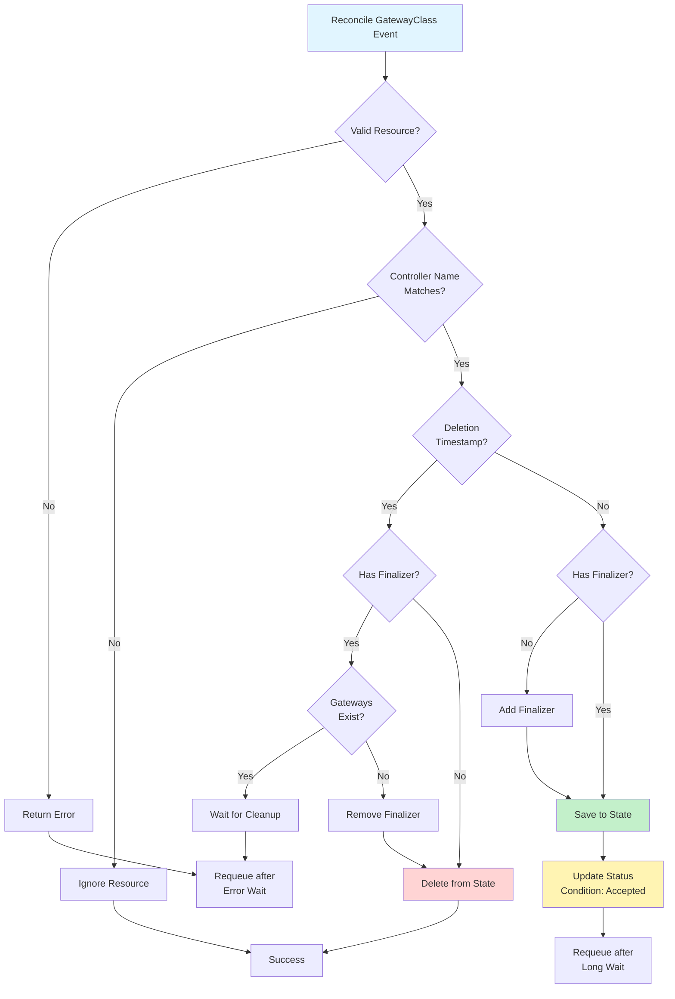
```mermaid
flowchart TD
    START[Reconcile GatewayClass Event] --> VALIDATE{Valid Resource?}
    VALIDATE -->|No| ERROR[Return Error]
    VALIDATE -->|Yes| CHECK_CTRL{Controller Name<br/>Matches?}

    CHECK_CTRL -->|No| IGNORE[Ignore Resource]
    CHECK_CTRL -->|Yes| CHECK_DEL{Deletion<br/>Timestamp?}

    CHECK_DEL -->|Yes| HAS_FIN{Has Finalizer?}
    HAS_FIN -->|Yes| CHECK_GATEWAYS{Gateways<br/>Exist?}
    CHECK_GATEWAYS -->|Yes| WAIT[Wait for Cleanup]
    CHECK_GATEWAYS -->|No| REMOVE_FIN[Remove Finalizer]
    REMOVE_FIN --> DELETE[Delete from State]
    HAS_FIN -->|No| DELETE

    CHECK_DEL -->|No| ADD_FIN{Has Finalizer?}
    ADD_FIN -->|No| PATCH_FIN[Add Finalizer]
    ADD_FIN -->|Yes| SAVE[Save to State]
    PATCH_FIN --> SAVE

    SAVE --> UPDATE_STATUS[Update Status<br/>Condition: Accepted]
    UPDATE_STATUS --> REQUEUE[Requeue after<br/>Long Wait]

    ERROR --> RETRY[Requeue after<br/>Error Wait]
    WAIT --> RETRY
    DELETE --> SUCCESS[Success]
    IGNORE --> SUCCESS

    style START fill:#e1f5ff
    style SAVE fill:#c3f0ca
    style DELETE fill:#ffd4d4
    style UPDATE_STATUS fill:#fff4b3
```

### Gateway Controller

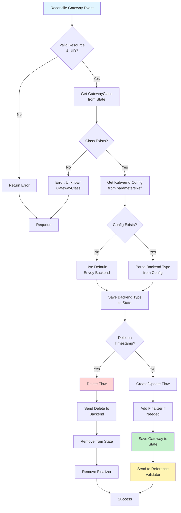
```mermaid
flowchart TD
    START[Reconcile Gateway Event] --> VALIDATE{Valid Resource<br/>& UID?}
    VALIDATE -->|No| ERROR[Return Error]
    VALIDATE -->|Yes| GET_CLASS[Get GatewayClass<br/>from State]

    GET_CLASS --> CLASS_EXISTS{Class Exists?}
    CLASS_EXISTS -->|No| ERROR_CLASS[Error: Unknown<br/>GatewayClass]
    CLASS_EXISTS -->|Yes| GET_CONFIG[Get KubvernorConfig<br/>from parametersRef]

    GET_CONFIG --> CONFIG_EXISTS{Config Exists?}
    CONFIG_EXISTS -->|No| USE_DEFAULT[Use Default:<br/>Envoy Backend]
    CONFIG_EXISTS -->|Yes| PARSE_BACKEND[Parse Backend Type<br/>from Config]

    PARSE_BACKEND --> SAVE_TYPE[Save Backend Type<br/>to State]
    USE_DEFAULT --> SAVE_TYPE

    SAVE_TYPE --> CHECK_DEL{Deletion<br/>Timestamp?}

    CHECK_DEL -->|Yes| DELETE_FLOW[Delete Flow]
    CHECK_DEL -->|No| CREATE_UPDATE[Create/Update Flow]

    CREATE_UPDATE --> ADD_FIN[Add Finalizer if<br/>Needed]
    ADD_FIN --> SAVE_GW[Save Gateway to<br/>State]
    SAVE_GW --> SEND_REF[Send to Reference<br/>Validator]

    DELETE_FLOW --> SEND_DELETE[Send Delete to<br/>Backend]
    SEND_DELETE --> REMOVE_STATE[Remove from State]
    REMOVE_STATE --> REMOVE_FIN[Remove Finalizer]

    SEND_REF --> SUCCESS[Success]
    REMOVE_FIN --> SUCCESS
    ERROR --> RETRY[Requeue]
    ERROR_CLASS --> RETRY

    style START fill:#e1f5ff
    style SAVE_GW fill:#c3f0ca
    style SEND_REF fill:#fff4b3
    style DELETE_FLOW fill:#ffd4d4
```

### HTTPRoute Controller

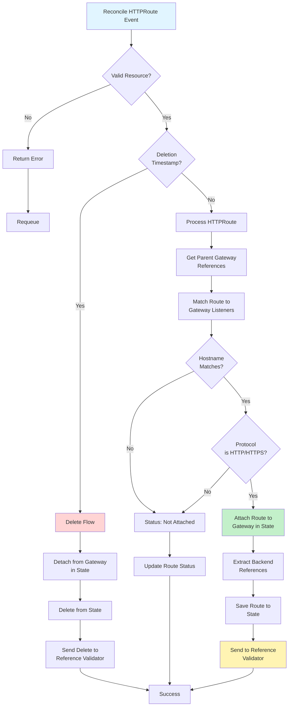
```mermaid
flowchart TD
    START[Reconcile HTTPRoute Event] --> VALIDATE{Valid Resource?}
    VALIDATE -->|No| ERROR[Return Error]
    VALIDATE -->|Yes| CHECK_DEL{Deletion<br/>Timestamp?}

    CHECK_DEL -->|Yes| DELETE_FLOW[Delete Flow]
    CHECK_DEL -->|No| PROCESS[Process HTTPRoute]

    PROCESS --> GET_PARENTS[Get Parent Gateway<br/>References]
    GET_PARENTS --> MATCH_LISTENERS[Match Route to<br/>Gateway Listeners]

    MATCH_LISTENERS --> HOSTNAME_MATCH{Hostname<br/>Matches?}
    HOSTNAME_MATCH -->|No| SET_NOT_ATTACHED[Status: Not Attached]
    HOSTNAME_MATCH -->|Yes| PROTOCOL_MATCH{Protocol<br/>is HTTP/HTTPS?}

    PROTOCOL_MATCH -->|No| SET_NOT_ATTACHED
    PROTOCOL_MATCH -->|Yes| ATTACH[Attach Route to<br/>Gateway in State]

    ATTACH --> EXTRACT_REFS[Extract Backend<br/>References]
    EXTRACT_REFS --> SAVE_ROUTE[Save Route to<br/>State]
    SAVE_ROUTE --> SEND_REF[Send to Reference<br/>Validator]

    DELETE_FLOW --> DETACH[Detach from Gateway<br/>in State]
    DETACH --> DELETE_STATE[Delete from State]
    DELETE_STATE --> SEND_DELETE_REF[Send Delete to<br/>Reference Validator]

    SEND_REF --> SUCCESS[Success]
    SEND_DELETE_REF --> SUCCESS
    SET_NOT_ATTACHED --> UPDATE_STATUS[Update Route Status]
    UPDATE_STATUS --> SUCCESS
    ERROR --> RETRY[Requeue]

    style START fill:#e1f5ff
    style ATTACH fill:#c3f0ca
    style SEND_REF fill:#fff4b3
    style DELETE_FLOW fill:#ffd4d4
```

### GRPCRoute Controller

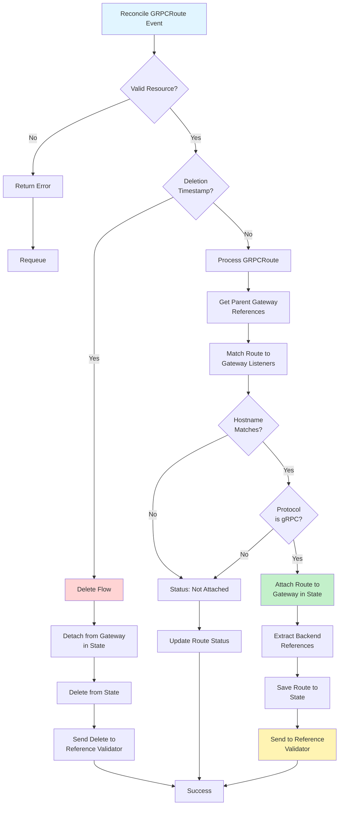
```mermaid
flowchart TD
    START[Reconcile GRPCRoute Event] --> VALIDATE{Valid Resource?}
    VALIDATE -->|No| ERROR[Return Error]
    VALIDATE -->|Yes| CHECK_DEL{Deletion<br/>Timestamp?}

    CHECK_DEL -->|Yes| DELETE_FLOW[Delete Flow]
    CHECK_DEL -->|No| PROCESS[Process GRPCRoute]

    PROCESS --> GET_PARENTS[Get Parent Gateway<br/>References]
    GET_PARENTS --> MATCH_LISTENERS[Match Route to<br/>Gateway Listeners]

    MATCH_LISTENERS --> HOSTNAME_MATCH{Hostname<br/>Matches?}
    HOSTNAME_MATCH -->|No| SET_NOT_ATTACHED[Status: Not Attached]
    HOSTNAME_MATCH -->|Yes| PROTOCOL_MATCH{Protocol<br/>is gRPC?}

    PROTOCOL_MATCH -->|No| SET_NOT_ATTACHED
    PROTOCOL_MATCH -->|Yes| ATTACH[Attach Route to<br/>Gateway in State]

    ATTACH --> EXTRACT_REFS[Extract Backend<br/>References]
    EXTRACT_REFS --> SAVE_ROUTE[Save Route to<br/>State]
    SAVE_ROUTE --> SEND_REF[Send to Reference<br/>Validator]

    DELETE_FLOW --> DETACH[Detach from Gateway<br/>in State]
    DETACH --> DELETE_STATE[Delete from State]
    DELETE_STATE --> SEND_DELETE_REF[Send Delete to<br/>Reference Validator]

    SEND_REF --> SUCCESS[Success]
    SEND_DELETE_REF --> SUCCESS
    SET_NOT_ATTACHED --> UPDATE_STATUS[Update Route Status]
    UPDATE_STATUS --> SUCCESS
    ERROR --> RETRY[Requeue]

    style START fill:#e1f5ff
    style ATTACH fill:#c3f0ca
    style SEND_REF fill:#fff4b3
    style DELETE_FLOW fill:#ffd4d4
```

### InferencePool Controller

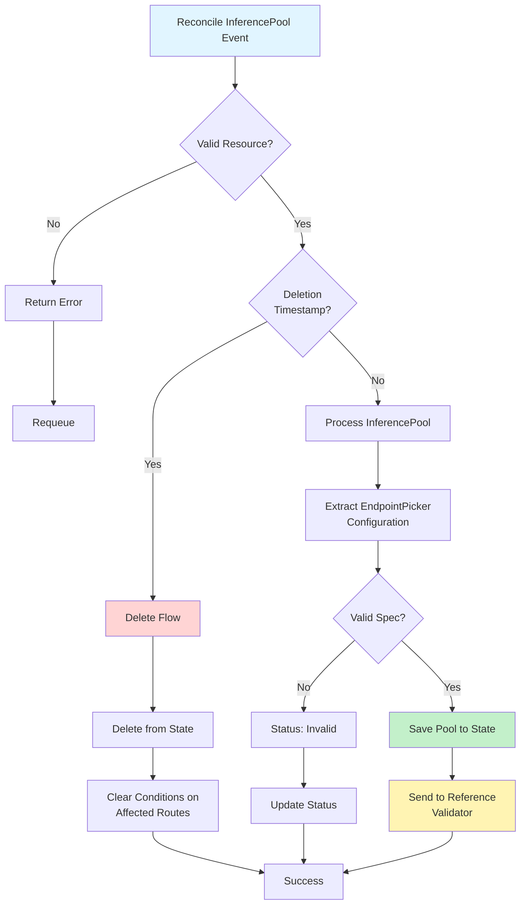
```mermaid
flowchart TD
    START[Reconcile InferencePool Event] --> VALIDATE{Valid Resource?}
    VALIDATE -->|No| ERROR[Return Error]
    VALIDATE -->|Yes| CHECK_DEL{Deletion<br/>Timestamp?}

    CHECK_DEL -->|Yes| DELETE_FLOW[Delete Flow]
    CHECK_DEL -->|No| PROCESS[Process InferencePool]

    PROCESS --> EXTRACT_SPEC[Extract EndpointPicker<br/>Configuration]
    EXTRACT_SPEC --> VALIDATE_SPEC{Valid Spec?}
    VALIDATE_SPEC -->|No| SET_INVALID[Status: Invalid]
    VALIDATE_SPEC -->|Yes| SAVE_POOL[Save Pool to State]

    SAVE_POOL --> SEND_REF[Send to Reference<br/>Validator]

    DELETE_FLOW --> DELETE_STATE[Delete from State]
    DELETE_STATE --> CLEAR_CONDITIONS[Clear Conditions on<br/>Affected Routes]

    SEND_REF --> SUCCESS[Success]
    CLEAR_CONDITIONS --> SUCCESS
    SET_INVALID --> UPDATE_STATUS[Update Status]
    UPDATE_STATUS --> SUCCESS
    ERROR --> RETRY[Requeue]

    style START fill:#e1f5ff
    style SAVE_POOL fill:#c3f0ca
    style SEND_REF fill:#fff4b3
    style DELETE_FLOW fill:#ffd4d4
```

## Services Layer

### Gateway Deployer Service

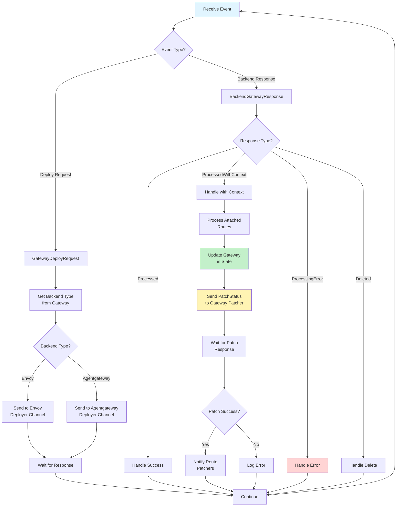
```mermaid
flowchart TD
    START[Receive Event] --> EVENT_TYPE{Event Type?}

    EVENT_TYPE -->|Deploy Request| DEPLOY[GatewayDeployRequest]
    EVENT_TYPE -->|Backend Response| RESPONSE[BackendGatewayResponse]

    DEPLOY --> GET_TYPE[Get Backend Type<br/>from Gateway]
    GET_TYPE --> ROUTE_BACKEND{Backend Type?}

    ROUTE_BACKEND -->|Envoy| ENVOY_CHANNEL[Send to Envoy<br/>Deployer Channel]
    ROUTE_BACKEND -->|Agentgateway| AGENT_CHANNEL[Send to Agentgateway<br/>Deployer Channel]

    ENVOY_CHANNEL --> WAIT[Wait for Response]
    AGENT_CHANNEL --> WAIT

    RESPONSE --> RESP_TYPE{Response Type?}

    RESP_TYPE -->|Processed| HANDLE_SUCCESS[Handle Success]
    RESP_TYPE -->|ProcessedWithContext| HANDLE_CONTEXT[Handle with Context]
    RESP_TYPE -->|ProcessingError| HANDLE_ERROR[Handle Error]
    RESP_TYPE -->|Deleted| HANDLE_DELETE[Handle Delete]

    HANDLE_CONTEXT --> PROCESS_ROUTES[Process Attached<br/>Routes]
    PROCESS_ROUTES --> UPDATE_STATE[Update Gateway<br/>in State]
    UPDATE_STATE --> PATCH_STATUS[Send PatchStatus<br/>to Gateway Patcher]

    PATCH_STATUS --> WAIT_PATCH[Wait for Patch<br/>Response]
    WAIT_PATCH --> PATCH_RESULT{Patch Success?}

    PATCH_RESULT -->|Yes| NOTIFY_ROUTES[Notify Route<br/>Patchers]
    PATCH_RESULT -->|No| LOG_ERROR[Log Error]

    NOTIFY_ROUTES --> CONTINUE[Continue]
    HANDLE_SUCCESS --> CONTINUE
    HANDLE_ERROR --> CONTINUE
    HANDLE_DELETE --> CONTINUE
    LOG_ERROR --> CONTINUE
    WAIT --> CONTINUE

    CONTINUE --> START

    style START fill:#e1f5ff
    style UPDATE_STATE fill:#c3f0ca
    style PATCH_STATUS fill:#fff4b3
    style HANDLE_ERROR fill:#ffd4d4
```

### Reference Validator Service

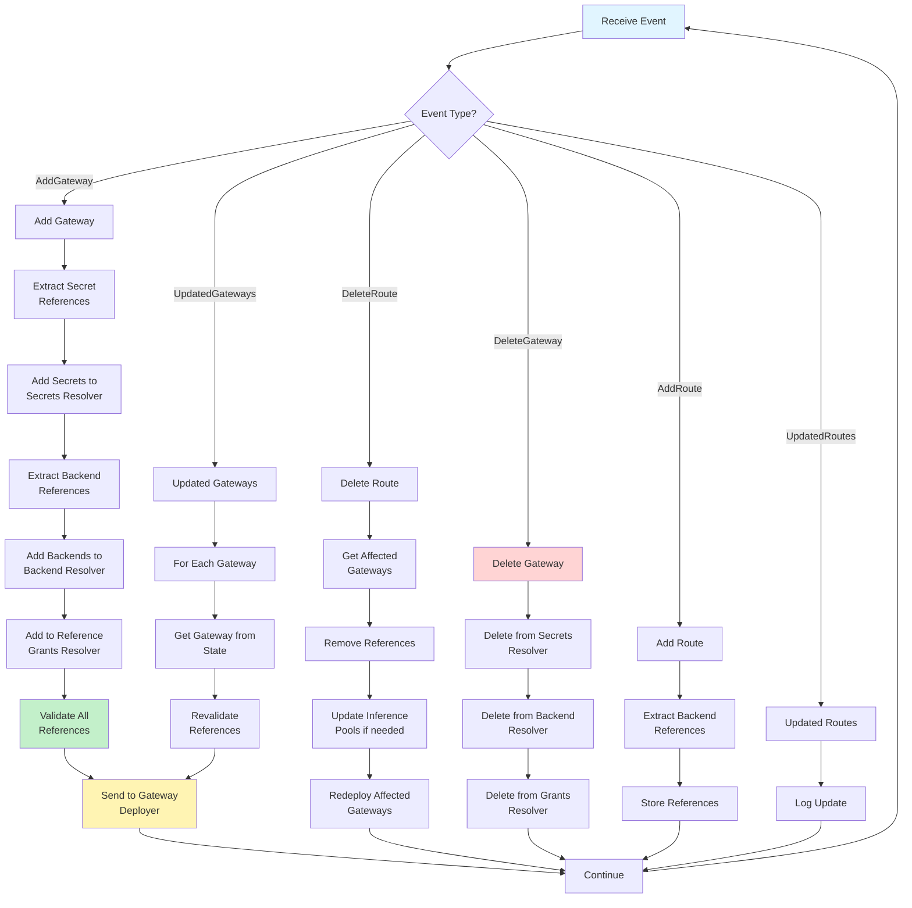
```mermaid
flowchart TD
    START[Receive Event] --> EVENT_TYPE{Event Type?}

    EVENT_TYPE -->|AddGateway| ADD_GW[Add Gateway]
    EVENT_TYPE -->|DeleteGateway| DEL_GW[Delete Gateway]
    EVENT_TYPE -->|AddRoute| ADD_RT[Add Route]
    EVENT_TYPE -->|DeleteRoute| DEL_RT[Delete Route]
    EVENT_TYPE -->|UpdatedGateways| UPD_GW[Updated Gateways]
    EVENT_TYPE -->|UpdatedRoutes| UPD_RT[Updated Routes]

    ADD_GW --> EXTRACT_SEC[Extract Secret<br/>References]
    EXTRACT_SEC --> ADD_SECRETS[Add Secrets to<br/>Secrets Resolver]
    ADD_SECRETS --> EXTRACT_BACKENDS[Extract Backend<br/>References]
    EXTRACT_BACKENDS --> ADD_BACKENDS[Add Backends to<br/>Backend Resolver]
    ADD_BACKENDS --> ADD_GRANTS[Add to Reference<br/>Grants Resolver]
    ADD_GRANTS --> VALIDATE_REFS[Validate All<br/>References]
    VALIDATE_REFS --> SEND_DEPLOY[Send to Gateway<br/>Deployer]

    DEL_GW --> DEL_SECRETS[Delete from Secrets<br/>Resolver]
    DEL_SECRETS --> DEL_BACKENDS[Delete from Backend<br/>Resolver]
    DEL_BACKENDS --> DEL_GRANTS[Delete from Grants<br/>Resolver]

    ADD_RT --> EXTRACT_RT_REFS[Extract Backend<br/>References]
    EXTRACT_RT_REFS --> STORE_RT_REFS[Store References]

    DEL_RT --> GET_AFFECTED[Get Affected<br/>Gateways]
    GET_AFFECTED --> REMOVE_REFS[Remove References]
    REMOVE_REFS --> UPDATE_POOLS[Update Inference<br/>Pools if needed]
    UPDATE_POOLS --> REDEPLOY_GW[Redeploy Affected<br/>Gateways]

    UPD_GW --> LOOP_GW[For Each Gateway]
    LOOP_GW --> GET_GW_STATE[Get Gateway from<br/>State]
    GET_GW_STATE --> REVALIDATE[Revalidate<br/>References]
    REVALIDATE --> SEND_DEPLOY

    UPD_RT --> LOG_UPDATE[Log Update]

    SEND_DEPLOY --> CONTINUE[Continue]
    REDEPLOY_GW --> CONTINUE
    DEL_GRANTS --> CONTINUE
    STORE_RT_REFS --> CONTINUE
    LOG_UPDATE --> CONTINUE

    CONTINUE --> START

    style START fill:#e1f5ff
    style VALIDATE_REFS fill:#c3f0ca
    style SEND_DEPLOY fill:#fff4b3
    style DEL_GW fill:#ffd4d4
```

### Patcher Service (Generic)

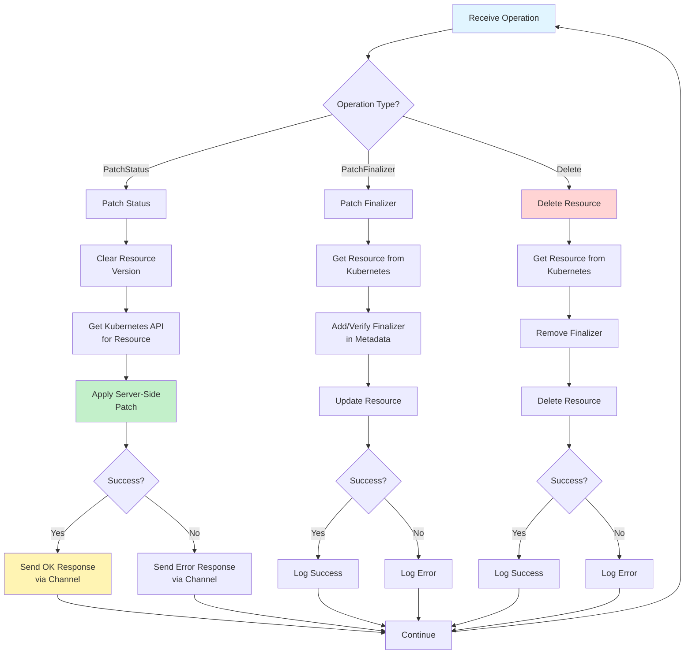
```mermaid
flowchart TD
    START[Receive Operation] --> OP_TYPE{Operation Type?}

    OP_TYPE -->|PatchStatus| PATCH_STATUS[Patch Status]
    OP_TYPE -->|PatchFinalizer| PATCH_FIN[Patch Finalizer]
    OP_TYPE -->|Delete| DELETE[Delete Resource]

    PATCH_STATUS --> CLEAR_VERSION[Clear Resource<br/>Version]
    CLEAR_VERSION --> GET_API[Get Kubernetes API<br/>for Resource]
    GET_API --> APPLY_PATCH[Apply Server-Side<br/>Patch]
    APPLY_PATCH --> PATCH_RESULT{Success?}

    PATCH_RESULT -->|Yes| SEND_RESPONSE[Send OK Response<br/>via Channel]
    PATCH_RESULT -->|No| SEND_ERROR[Send Error Response<br/>via Channel]

    PATCH_FIN --> GET_RESOURCE[Get Resource from<br/>Kubernetes]
    GET_RESOURCE --> ADD_FINALIZER[Add/Verify Finalizer<br/>in Metadata]
    ADD_FINALIZER --> UPDATE_RESOURCE[Update Resource]
    UPDATE_RESOURCE --> FIN_RESULT{Success?}

    FIN_RESULT -->|Yes| LOG_SUCCESS[Log Success]
    FIN_RESULT -->|No| LOG_FIN_ERROR[Log Error]

    DELETE --> GET_FOR_DELETE[Get Resource from<br/>Kubernetes]
    GET_FOR_DELETE --> REMOVE_FINALIZER[Remove Finalizer]
    REMOVE_FINALIZER --> DELETE_RESOURCE[Delete Resource]
    DELETE_RESOURCE --> DEL_RESULT{Success?}

    DEL_RESULT -->|Yes| LOG_DEL_SUCCESS[Log Success]
    DEL_RESULT -->|No| LOG_DEL_ERROR[Log Error]

    SEND_RESPONSE --> CONTINUE[Continue]
    SEND_ERROR --> CONTINUE
    LOG_SUCCESS --> CONTINUE
    LOG_FIN_ERROR --> CONTINUE
    LOG_DEL_SUCCESS --> CONTINUE
    LOG_DEL_ERROR --> CONTINUE

    CONTINUE --> START

    style START fill:#e1f5ff
    style APPLY_PATCH fill:#c3f0ca
    style SEND_RESPONSE fill:#fff4b3
    style DELETE fill:#ffd4d4
```

## Reference Resolvers

### Secrets Resolver

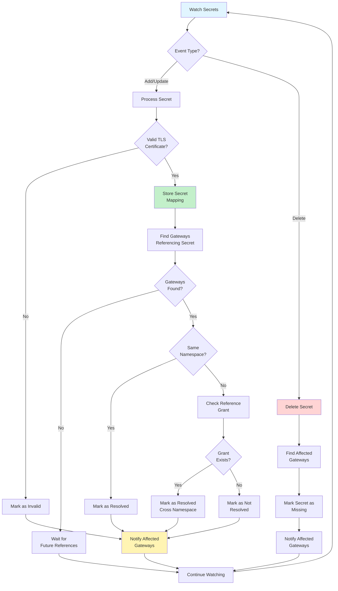
```mermaid
flowchart TD
    START[Watch Secrets] --> EVENT{Event Type?}

    EVENT -->|Add/Update| PROCESS_SECRET[Process Secret]
    EVENT -->|Delete| DELETE_SECRET[Delete Secret]

    PROCESS_SECRET --> VALIDATE_FORMAT{Valid TLS<br/>Certificate?}
    VALIDATE_FORMAT -->|No| MARK_INVALID[Mark as Invalid]
    VALIDATE_FORMAT -->|Yes| STORE_SECRET[Store Secret<br/>Mapping]

    STORE_SECRET --> FIND_GATEWAYS[Find Gateways<br/>Referencing Secret]
    FIND_GATEWAYS --> HAS_GATEWAYS{Gateways<br/>Found?}

    HAS_GATEWAYS -->|No| WAIT[Wait for<br/>Future References]
    HAS_GATEWAYS -->|Yes| CHECK_NAMESPACE{Same<br/>Namespace?}

    CHECK_NAMESPACE -->|Yes| MARK_RESOLVED[Mark as Resolved]
    CHECK_NAMESPACE -->|No| CHECK_GRANT[Check Reference<br/>Grant]

    CHECK_GRANT --> GRANT_EXISTS{Grant<br/>Exists?}
    GRANT_EXISTS -->|Yes| MARK_CROSS_RESOLVED[Mark as Resolved<br/>Cross Namespace]
    GRANT_EXISTS -->|No| MARK_NOT_RESOLVED[Mark as Not<br/>Resolved]

    MARK_RESOLVED --> NOTIFY[Notify Affected<br/>Gateways]
    MARK_CROSS_RESOLVED --> NOTIFY
    MARK_INVALID --> NOTIFY
    MARK_NOT_RESOLVED --> NOTIFY

    DELETE_SECRET --> FIND_DEL_GATEWAYS[Find Affected<br/>Gateways]
    FIND_DEL_GATEWAYS --> MARK_MISSING[Mark Secret as<br/>Missing]
    MARK_MISSING --> NOTIFY_DEL[Notify Affected<br/>Gateways]

    NOTIFY --> CONTINUE[Continue Watching]
    NOTIFY_DEL --> CONTINUE
    WAIT --> CONTINUE

    CONTINUE --> START

    style START fill:#e1f5ff
    style STORE_SECRET fill:#c3f0ca
    style NOTIFY fill:#fff4b3
    style DELETE_SECRET fill:#ffd4d4
```

### Backend Reference Resolver

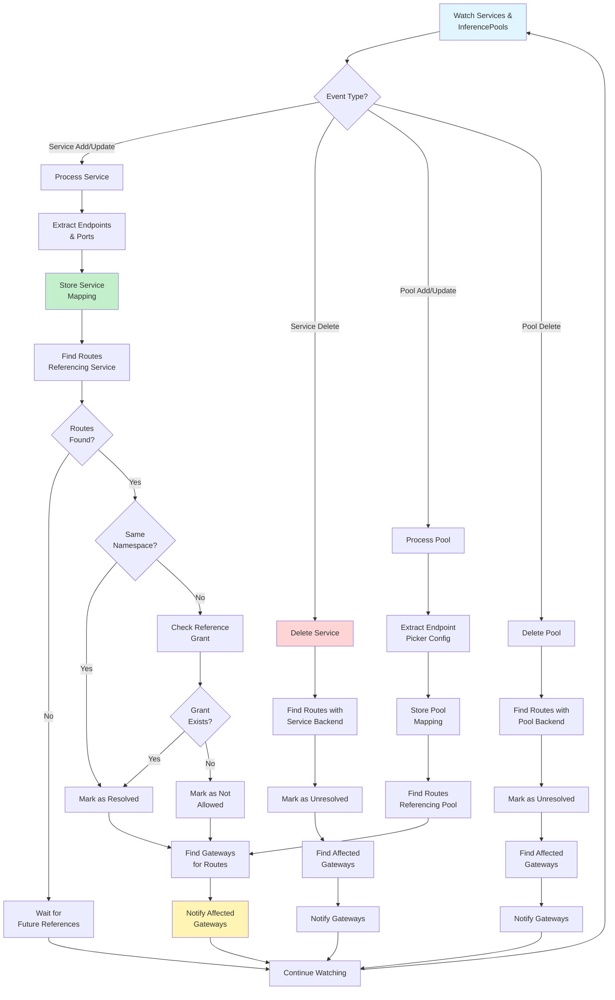
```mermaid
flowchart TD
    START[Watch Services &<br/>InferencePools] --> EVENT{Event Type?}

    EVENT -->|Service Add/Update| PROCESS_SVC[Process Service]
    EVENT -->|Service Delete| DELETE_SVC[Delete Service]
    EVENT -->|Pool Add/Update| PROCESS_POOL[Process Pool]
    EVENT -->|Pool Delete| DELETE_POOL[Delete Pool]

    PROCESS_SVC --> EXTRACT_ENDPOINTS[Extract Endpoints<br/>& Ports]
    EXTRACT_ENDPOINTS --> STORE_SVC[Store Service<br/>Mapping]
    STORE_SVC --> FIND_ROUTES[Find Routes<br/>Referencing Service]

    FIND_ROUTES --> HAS_ROUTES{Routes<br/>Found?}
    HAS_ROUTES -->|No| WAIT[Wait for<br/>Future References]
    HAS_ROUTES -->|Yes| CHECK_SVC_NS{Same<br/>Namespace?}

    CHECK_SVC_NS -->|Yes| MARK_SVC_RESOLVED[Mark as Resolved]
    CHECK_SVC_NS -->|No| CHECK_SVC_GRANT[Check Reference<br/>Grant]

    CHECK_SVC_GRANT --> SVC_GRANT_EXISTS{Grant<br/>Exists?}
    SVC_GRANT_EXISTS -->|Yes| MARK_SVC_RESOLVED
    SVC_GRANT_EXISTS -->|No| MARK_SVC_NOT_ALLOWED[Mark as Not<br/>Allowed]

    MARK_SVC_RESOLVED --> FIND_GATEWAYS[Find Gateways<br/>for Routes]
    MARK_SVC_NOT_ALLOWED --> FIND_GATEWAYS
    FIND_GATEWAYS --> NOTIFY_GW[Notify Affected<br/>Gateways]

    PROCESS_POOL --> EXTRACT_POOL_CONFIG[Extract Endpoint<br/>Picker Config]
    EXTRACT_POOL_CONFIG --> STORE_POOL[Store Pool<br/>Mapping]
    STORE_POOL --> FIND_POOL_ROUTES[Find Routes<br/>Referencing Pool]
    FIND_POOL_ROUTES --> FIND_GATEWAYS

    DELETE_SVC --> FIND_SVC_ROUTES[Find Routes with<br/>Service Backend]
    FIND_SVC_ROUTES --> MARK_SVC_UNRESOLVED[Mark as Unresolved]
    MARK_SVC_UNRESOLVED --> FIND_SVC_GATEWAYS[Find Affected<br/>Gateways]
    FIND_SVC_GATEWAYS --> NOTIFY_SVC_DEL[Notify Gateways]

    DELETE_POOL --> FIND_POOL_ROUTES_DEL[Find Routes with<br/>Pool Backend]
    FIND_POOL_ROUTES_DEL --> MARK_POOL_UNRESOLVED[Mark as Unresolved]
    MARK_POOL_UNRESOLVED --> FIND_POOL_GATEWAYS[Find Affected<br/>Gateways]
    FIND_POOL_GATEWAYS --> NOTIFY_POOL_DEL[Notify Gateways]

    NOTIFY_GW --> CONTINUE[Continue Watching]
    NOTIFY_SVC_DEL --> CONTINUE
    NOTIFY_POOL_DEL --> CONTINUE
    WAIT --> CONTINUE

    CONTINUE --> START

    style START fill:#e1f5ff
    style STORE_SVC fill:#c3f0ca
    style NOTIFY_GW fill:#fff4b3
    style DELETE_SVC fill:#ffd4d4
```

### Reference Grants Resolver

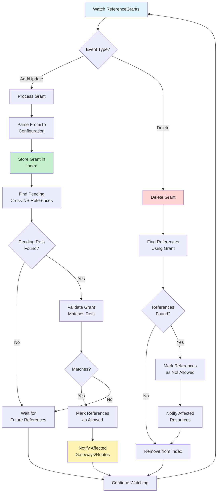
```mermaid
flowchart TD
    START[Watch ReferenceGrants] --> EVENT{Event Type?}

    EVENT -->|Add/Update| PROCESS_GRANT[Process Grant]
    EVENT -->|Delete| DELETE_GRANT[Delete Grant]

    PROCESS_GRANT --> PARSE_GRANT[Parse From/To<br/>Configuration]
    PARSE_GRANT --> STORE_GRANT[Store Grant in<br/>Index]

    STORE_GRANT --> FIND_PENDING[Find Pending<br/>Cross-NS References]
    FIND_PENDING --> HAS_PENDING{Pending Refs<br/>Found?}

    HAS_PENDING -->|No| WAIT[Wait for<br/>Future References]
    HAS_PENDING -->|Yes| VALIDATE_MATCH[Validate Grant<br/>Matches Refs]

    VALIDATE_MATCH --> MATCH_RESULT{Matches?}
    MATCH_RESULT -->|Yes| MARK_ALLOWED[Mark References<br/>as Allowed]
    MATCH_RESULT -->|No| WAIT

    MARK_ALLOWED --> NOTIFY_AFFECTED[Notify Affected<br/>Gateways/Routes]

    DELETE_GRANT --> FIND_USING[Find References<br/>Using Grant]
    FIND_USING --> HAS_USING{References<br/>Found?}

    HAS_USING -->|No| REMOVE_GRANT[Remove from Index]
    HAS_USING -->|Yes| MARK_NOT_ALLOWED[Mark References<br/>as Not Allowed]
    MARK_NOT_ALLOWED --> NOTIFY_REVOKED[Notify Affected<br/>Resources]
    NOTIFY_REVOKED --> REMOVE_GRANT

    NOTIFY_AFFECTED --> CONTINUE[Continue Watching]
    REMOVE_GRANT --> CONTINUE
    WAIT --> CONTINUE

    CONTINUE --> START

    style START fill:#e1f5ff
    style STORE_GRANT fill:#c3f0ca
    style NOTIFY_AFFECTED fill:#fff4b3
    style DELETE_GRANT fill:#ffd4d4
```

## Backend Deployers

### Envoy xDS Backend

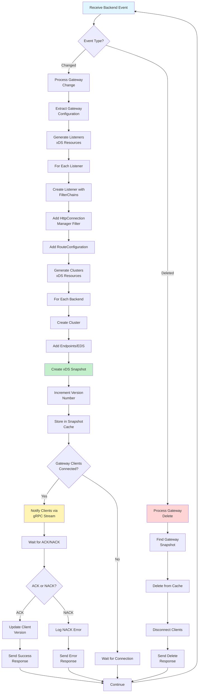
```mermaid
flowchart TD
    START[Receive Backend Event] --> EVENT_TYPE{Event Type?}

    EVENT_TYPE -->|Changed| PROCESS_CHANGE[Process Gateway<br/>Change]
    EVENT_TYPE -->|Deleted| PROCESS_DELETE[Process Gateway<br/>Delete]

    PROCESS_CHANGE --> EXTRACT_GW[Extract Gateway<br/>Configuration]
    EXTRACT_GW --> GEN_LISTENERS[Generate Listeners<br/>xDS Resources]

    GEN_LISTENERS --> PARSE_LISTENERS[For Each Listener]
    PARSE_LISTENERS --> CREATE_LISTENER[Create Listener with<br/>FilterChains]
    CREATE_LISTENER --> ADD_HCM[Add HttpConnection<br/>Manager Filter]
    ADD_HCM --> ADD_ROUTES[Add RouteConfiguration]

    ADD_ROUTES --> GEN_CLUSTERS[Generate Clusters<br/>xDS Resources]
    GEN_CLUSTERS --> PARSE_BACKENDS[For Each Backend]
    PARSE_BACKENDS --> CREATE_CLUSTER[Create Cluster]
    CREATE_CLUSTER --> ADD_ENDPOINTS[Add Endpoints/EDS]

    ADD_ENDPOINTS --> CREATE_SNAPSHOT[Create xDS Snapshot]
    CREATE_SNAPSHOT --> INC_VERSION[Increment Version<br/>Number]
    INC_VERSION --> STORE_SNAPSHOT[Store in Snapshot<br/>Cache]

    STORE_SNAPSHOT --> HAS_CLIENTS{Gateway Clients<br/>Connected?}
    HAS_CLIENTS -->|Yes| NOTIFY_CLIENTS[Notify Clients via<br/>gRPC Stream]
    HAS_CLIENTS -->|No| WAIT_CONN[Wait for Connection]

    NOTIFY_CLIENTS --> WAIT_ACK[Wait for ACK/NACK]
    WAIT_ACK --> ACK_RESULT{ACK or NACK?}

    ACK_RESULT -->|ACK| UPDATE_CLIENT_VERSION[Update Client<br/>Version]
    ACK_RESULT -->|NACK| LOG_NACK[Log NACK Error]

    UPDATE_CLIENT_VERSION --> SEND_RESPONSE[Send Success<br/>Response]
    LOG_NACK --> SEND_ERROR[Send Error<br/>Response]

    PROCESS_DELETE --> FIND_SNAPSHOT[Find Gateway<br/>Snapshot]
    FIND_SNAPSHOT --> DELETE_SNAPSHOT[Delete from Cache]
    DELETE_SNAPSHOT --> DISCONNECT[Disconnect Clients]
    DISCONNECT --> SEND_DEL_RESPONSE[Send Delete<br/>Response]

    SEND_RESPONSE --> CONTINUE[Continue]
    SEND_ERROR --> CONTINUE
    SEND_DEL_RESPONSE --> CONTINUE
    WAIT_CONN --> CONTINUE

    CONTINUE --> START

    style START fill:#e1f5ff
    style CREATE_SNAPSHOT fill:#c3f0ca
    style NOTIFY_CLIENTS fill:#fff4b3
    style PROCESS_DELETE fill:#ffd4d4
```

#### Envoy xDS Server (gRPC ADS)

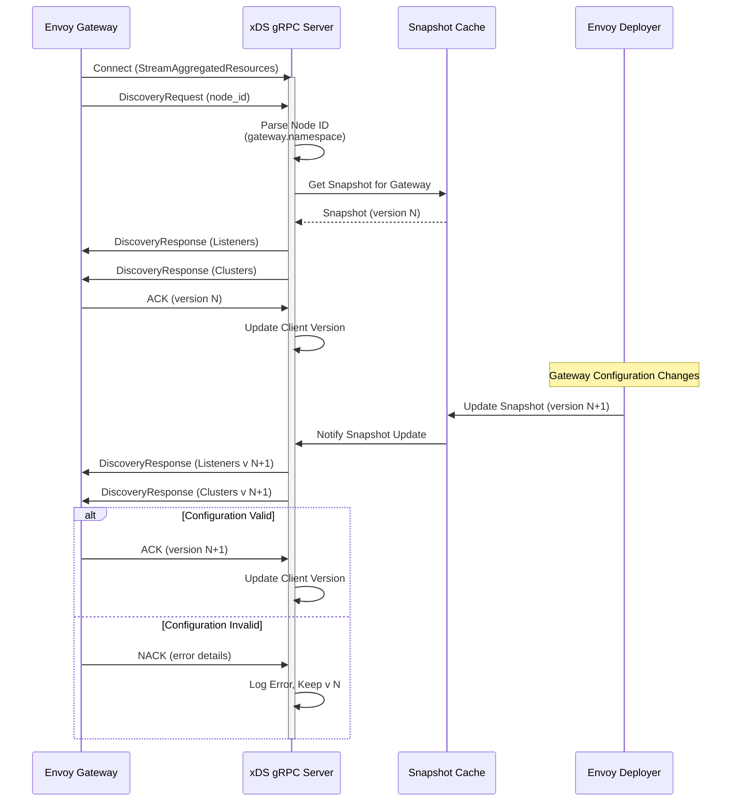
```mermaid
sequenceDiagram
    participant Envoy as Envoy Gateway
    participant Server as xDS gRPC Server
    participant Cache as Snapshot Cache
    participant Deployer as Envoy Deployer

    Envoy->>Server: Connect (StreamAggregatedResources)
    activate Server
    Envoy->>Server: DiscoveryRequest (node_id)
    Server->>Server: Parse Node ID<br/>(gateway.namespace)

    Server->>Cache: Get Snapshot for Gateway
    Cache-->>Server: Snapshot (version N)

    Server->>Envoy: DiscoveryResponse (Listeners)
    Server->>Envoy: DiscoveryResponse (Clusters)

    Envoy->>Server: ACK (version N)
    Server->>Server: Update Client Version

    Note over Deployer: Gateway Configuration Changes

    Deployer->>Cache: Update Snapshot (version N+1)
    Cache->>Server: Notify Snapshot Update

    Server->>Envoy: DiscoveryResponse (Listeners v N+1)
    Server->>Envoy: DiscoveryResponse (Clusters v N+1)

    alt Configuration Valid
        Envoy->>Server: ACK (version N+1)
        Server->>Server: Update Client Version
    else Configuration Invalid
        Envoy->>Server: NACK (error details)
        Server->>Server: Log Error, Keep v N
    end

    deactivate Server
```

### Agentgateway Backend

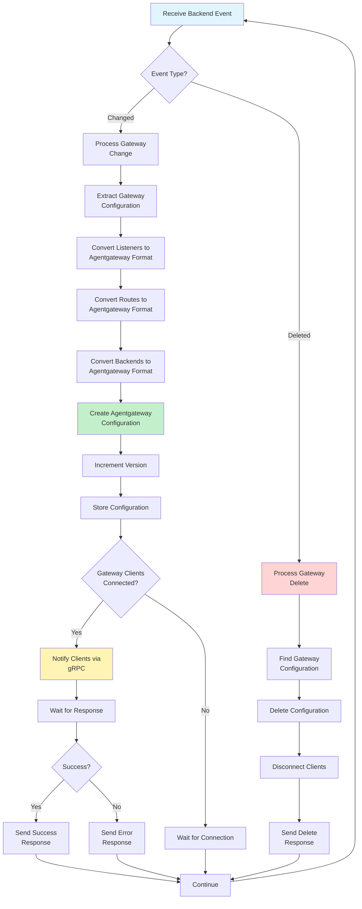
```mermaid
flowchart TD
    START[Receive Backend Event] --> EVENT_TYPE{Event Type?}

    EVENT_TYPE -->|Changed| PROCESS_CHANGE[Process Gateway<br/>Change]
    EVENT_TYPE -->|Deleted| PROCESS_DELETE[Process Gateway<br/>Delete]

    PROCESS_CHANGE --> EXTRACT_GW[Extract Gateway<br/>Configuration]
    EXTRACT_GW --> CONVERT_LISTENERS[Convert Listeners to<br/>Agentgateway Format]

    CONVERT_LISTENERS --> CONVERT_ROUTES[Convert Routes to<br/>Agentgateway Format]
    CONVERT_ROUTES --> CONVERT_BACKENDS[Convert Backends to<br/>Agentgateway Format]

    CONVERT_BACKENDS --> CREATE_CONFIG[Create Agentgateway<br/>Configuration]
    CREATE_CONFIG --> INC_VERSION[Increment Version]
    INC_VERSION --> STORE_CONFIG[Store Configuration]

    STORE_CONFIG --> HAS_CLIENTS{Gateway Clients<br/>Connected?}
    HAS_CLIENTS -->|Yes| NOTIFY_CLIENTS[Notify Clients via<br/>gRPC]
    HAS_CLIENTS -->|No| WAIT_CONN[Wait for Connection]

    NOTIFY_CLIENTS --> WAIT_ACK[Wait for Response]
    WAIT_ACK --> ACK_RESULT{Success?}

    ACK_RESULT -->|Yes| SEND_RESPONSE[Send Success<br/>Response]
    ACK_RESULT -->|No| SEND_ERROR[Send Error<br/>Response]

    PROCESS_DELETE --> FIND_CONFIG[Find Gateway<br/>Configuration]
    FIND_CONFIG --> DELETE_CONFIG[Delete Configuration]
    DELETE_CONFIG --> DISCONNECT[Disconnect Clients]
    DISCONNECT --> SEND_DEL_RESPONSE[Send Delete<br/>Response]

    SEND_RESPONSE --> CONTINUE[Continue]
    SEND_ERROR --> CONTINUE
    SEND_DEL_RESPONSE --> CONTINUE
    WAIT_CONN --> CONTINUE

    CONTINUE --> START

    style START fill:#e1f5ff
    style CREATE_CONFIG fill:#c3f0ca
    style NOTIFY_CLIENTS fill:#fff4b3
    style PROCESS_DELETE fill:#ffd4d4
```

## State Management

### State Structure and Access

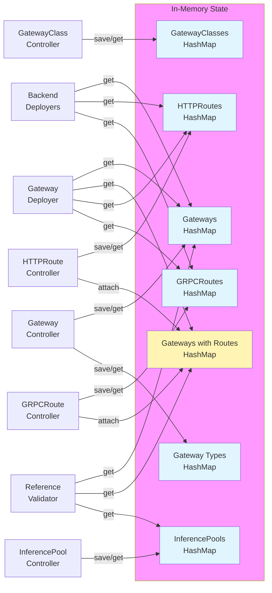
```mermaid
flowchart LR
    subgraph State[In-Memory State]
        GWC_MAP[GatewayClasses<br/>HashMap]
        GW_MAP[Gateways<br/>HashMap]
        HR_MAP[HTTPRoutes<br/>HashMap]
        GR_MAP[GRPCRoutes<br/>HashMap]
        GWR_MAP[Gateways with Routes<br/>HashMap]
        IP_MAP[InferencePools<br/>HashMap]
        GWTYPE_MAP[Gateway Types<br/>HashMap]
    end

    CTRL_GWC[GatewayClass<br/>Controller] -->|save/get| GWC_MAP
    CTRL_GW[Gateway<br/>Controller] -->|save/get| GW_MAP
    CTRL_GW -->|save/get| GWTYPE_MAP
    CTRL_HR[HTTPRoute<br/>Controller] -->|save/get| HR_MAP
    CTRL_HR -->|attach| GWR_MAP
    CTRL_GR[GRPCRoute<br/>Controller] -->|save/get| GR_MAP
    CTRL_GR -->|attach| GWR_MAP
    CTRL_IP[InferencePool<br/>Controller] -->|save/get| IP_MAP

    SVC_DEPLOYER[Gateway<br/>Deployer] -->|get| GW_MAP
    SVC_DEPLOYER -->|get| GWR_MAP
    SVC_DEPLOYER -->|get| HR_MAP
    SVC_DEPLOYER -->|get| GR_MAP

    SVC_REF[Reference<br/>Validator] -->|get| GW_MAP
    SVC_REF -->|get| GWR_MAP
    SVC_REF -->|get| IP_MAP

    BACKEND[Backend<br/>Deployers] -->|get| GW_MAP
    BACKEND -->|get| HR_MAP
    BACKEND -->|get| GR_MAP

    style State fill:#f9f
    style GWC_MAP fill:#e1f5ff
    style GW_MAP fill:#e1f5ff
    style HR_MAP fill:#e1f5ff
    style GR_MAP fill:#e1f5ff
    style GWR_MAP fill:#fff4b3
    style IP_MAP fill:#e1f5ff
    style GWTYPE_MAP fill:#e1f5ff
```

### State Synchronization

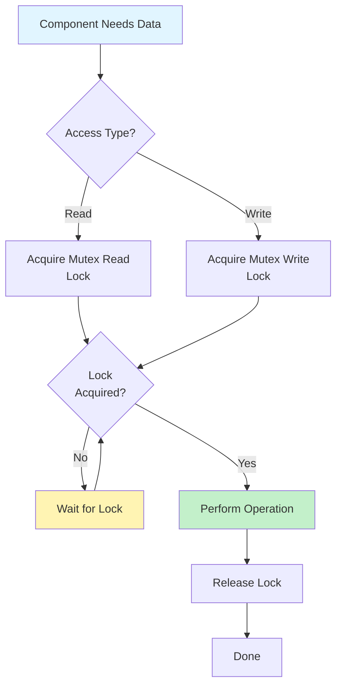
```mermaid
flowchart TD
    START[Component Needs Data] --> ACCESS_TYPE{Access Type?}

    ACCESS_TYPE -->|Read| ACQUIRE_LOCK[Acquire Mutex Read<br/>Lock]
    ACCESS_TYPE -->|Write| ACQUIRE_WRITE[Acquire Mutex Write<br/>Lock]

    ACQUIRE_LOCK --> LOCK_ACQUIRED{Lock<br/>Acquired?}
    ACQUIRE_WRITE --> LOCK_ACQUIRED

    LOCK_ACQUIRED -->|No| WAIT[Wait for Lock]
    WAIT --> LOCK_ACQUIRED

    LOCK_ACQUIRED -->|Yes| PERFORM_OP[Perform Operation]
    PERFORM_OP --> RELEASE_LOCK[Release Lock]

    RELEASE_LOCK --> DONE[Done]

    style START fill:#e1f5ff
    style PERFORM_OP fill:#c3f0ca
    style WAIT fill:#fff4b3
```

## Sequence Diagrams

### Gateway Creation Flow (Complete)

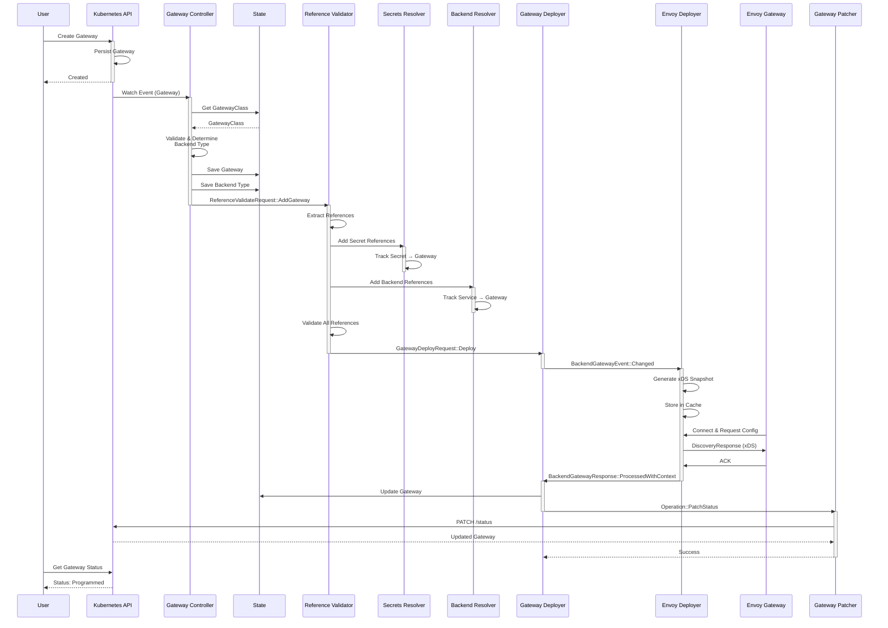
```mermaid
sequenceDiagram
    participant User
    participant K8s as Kubernetes API
    participant GWCtrl as Gateway Controller
    participant State
    participant RefVal as Reference Validator
    participant SecRes as Secrets Resolver
    participant BkRes as Backend Resolver
    participant GWDep as Gateway Deployer
    participant EnvDep as Envoy Deployer
    participant Envoy as Envoy Gateway
    participant GWPatch as Gateway Patcher

    User->>K8s: Create Gateway
    activate K8s
    K8s->>K8s: Persist Gateway
    K8s-->>User: Created
    deactivate K8s

    K8s->>GWCtrl: Watch Event (Gateway)
    activate GWCtrl
    GWCtrl->>State: Get GatewayClass
    State-->>GWCtrl: GatewayClass
    GWCtrl->>GWCtrl: Validate & Determine<br/>Backend Type
    GWCtrl->>State: Save Gateway
    GWCtrl->>State: Save Backend Type
    GWCtrl->>RefVal: ReferenceValidateRequest::AddGateway
    deactivate GWCtrl

    activate RefVal
    RefVal->>RefVal: Extract References
    RefVal->>SecRes: Add Secret References
    activate SecRes
    SecRes->>SecRes: Track Secret → Gateway
    deactivate SecRes

    RefVal->>BkRes: Add Backend References
    activate BkRes
    BkRes->>BkRes: Track Service → Gateway
    deactivate BkRes

    RefVal->>RefVal: Validate All References
    RefVal->>GWDep: GatewayDeployRequest::Deploy
    deactivate RefVal

    activate GWDep
    GWDep->>EnvDep: BackendGatewayEvent::Changed
    deactivate GWDep

    activate EnvDep
    EnvDep->>EnvDep: Generate xDS Snapshot
    EnvDep->>EnvDep: Store in Cache

    Envoy->>EnvDep: Connect & Request Config
    EnvDep->>Envoy: DiscoveryResponse (xDS)
    Envoy->>EnvDep: ACK

    EnvDep->>GWDep: BackendGatewayResponse::ProcessedWithContext
    deactivate EnvDep

    activate GWDep
    GWDep->>State: Update Gateway
    GWDep->>GWPatch: Operation::PatchStatus
    deactivate GWDep

    activate GWPatch
    GWPatch->>K8s: PATCH /status
    K8s-->>GWPatch: Updated Gateway
    GWPatch-->>GWDep: Success
    deactivate GWPatch

    User->>K8s: Get Gateway Status
    K8s-->>User: Status: Programmed
```

### HTTPRoute Attachment Flow

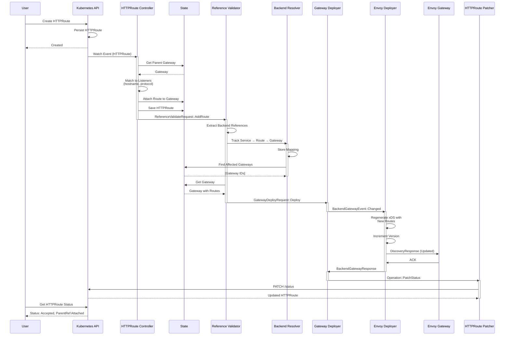
```mermaid
sequenceDiagram
    participant User
    participant K8s as Kubernetes API
    participant HRCtrl as HTTPRoute Controller
    participant State
    participant RefVal as Reference Validator
    participant BkRes as Backend Resolver
    participant GWDep as Gateway Deployer
    participant EnvDep as Envoy Deployer
    participant Envoy as Envoy Gateway
    participant HRPatch as HTTPRoute Patcher

    User->>K8s: Create HTTPRoute
    K8s->>K8s: Persist HTTPRoute
    K8s-->>User: Created

    K8s->>HRCtrl: Watch Event (HTTPRoute)
    activate HRCtrl
    HRCtrl->>State: Get Parent Gateway
    State-->>HRCtrl: Gateway

    HRCtrl->>HRCtrl: Match to Listeners<br/>(hostname, protocol)
    HRCtrl->>State: Attach Route to Gateway
    HRCtrl->>State: Save HTTPRoute

    HRCtrl->>RefVal: ReferenceValidateRequest::AddRoute
    deactivate HRCtrl

    activate RefVal
    RefVal->>RefVal: Extract Backend References
    RefVal->>BkRes: Track Service → Route → Gateway
    activate BkRes
    BkRes->>BkRes: Store Mapping
    BkRes->>State: Find Affected Gateways
    State-->>BkRes: [Gateway IDs]
    deactivate BkRes

    RefVal->>State: Get Gateway
    State-->>RefVal: Gateway with Routes
    RefVal->>GWDep: GatewayDeployRequest::Deploy
    deactivate RefVal

    activate GWDep
    GWDep->>EnvDep: BackendGatewayEvent::Changed
    deactivate GWDep

    activate EnvDep
    EnvDep->>EnvDep: Regenerate xDS with<br/>New Routes
    EnvDep->>EnvDep: Increment Version
    EnvDep->>Envoy: DiscoveryResponse (Updated)
    Envoy->>EnvDep: ACK
    EnvDep->>GWDep: BackendGatewayResponse
    deactivate EnvDep

    activate GWDep
    GWDep->>HRPatch: Operation::PatchStatus
    deactivate GWDep

    activate HRPatch
    HRPatch->>K8s: PATCH /status
    K8s-->>HRPatch: Updated HTTPRoute
    deactivate HRPatch

    User->>K8s: Get HTTPRoute Status
    K8s-->>User: Status: Accepted, ParentRef Attached
```

### Service Update Flow

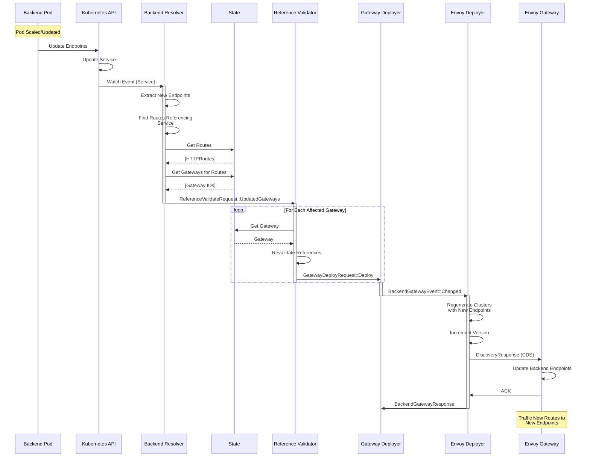
```mermaid
sequenceDiagram
    participant Pod as Backend Pod
    participant K8s as Kubernetes API
    participant BkRes as Backend Resolver
    participant State
    participant RefVal as Reference Validator
    participant GWDep as Gateway Deployer
    participant EnvDep as Envoy Deployer
    participant Envoy as Envoy Gateway

    Note over Pod: Pod Scaled/Updated

    Pod->>K8s: Update Endpoints
    K8s->>K8s: Update Service

    K8s->>BkRes: Watch Event (Service)
    activate BkRes
    BkRes->>BkRes: Extract New Endpoints
    BkRes->>BkRes: Find Routes Referencing<br/>Service
    BkRes->>State: Get Routes
    State-->>BkRes: [HTTPRoutes]

    BkRes->>State: Get Gateways for Routes
    State-->>BkRes: [Gateway IDs]

    BkRes->>RefVal: ReferenceValidateRequest::UpdatedGateways
    deactivate BkRes

    activate RefVal
    loop For Each Affected Gateway
        RefVal->>State: Get Gateway
        State-->>RefVal: Gateway
        RefVal->>RefVal: Revalidate References
        RefVal->>GWDep: GatewayDeployRequest::Deploy
    end
    deactivate RefVal

    activate GWDep
    GWDep->>EnvDep: BackendGatewayEvent::Changed
    deactivate GWDep

    activate EnvDep
    EnvDep->>EnvDep: Regenerate Clusters<br/>with New Endpoints
    EnvDep->>EnvDep: Increment Version
    EnvDep->>Envoy: DiscoveryResponse (CDS)
    Envoy->>Envoy: Update Backend Endpoints
    Envoy->>EnvDep: ACK
    EnvDep->>GWDep: BackendGatewayResponse
    deactivate EnvDep

    Note over Envoy: Traffic Now Routes to<br/>New Endpoints
```

### Secret Update Flow (TLS Certificate)

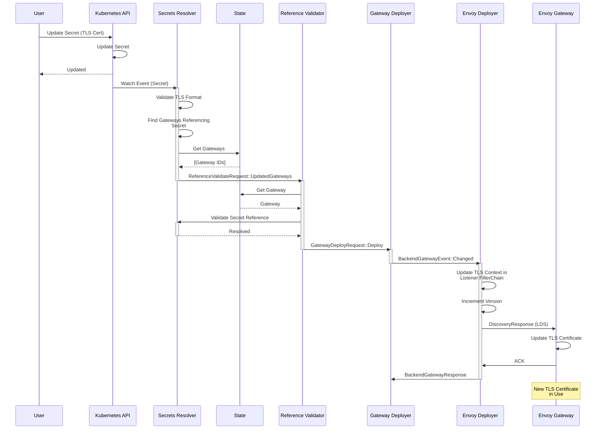
```mermaid
sequenceDiagram
    participant User
    participant K8s as Kubernetes API
    participant SecRes as Secrets Resolver
    participant State
    participant RefVal as Reference Validator
    participant GWDep as Gateway Deployer
    participant EnvDep as Envoy Deployer
    participant Envoy as Envoy Gateway

    User->>K8s: Update Secret (TLS Cert)
    K8s->>K8s: Update Secret
    K8s-->>User: Updated

    K8s->>SecRes: Watch Event (Secret)
    activate SecRes
    SecRes->>SecRes: Validate TLS Format
    SecRes->>SecRes: Find Gateways Referencing<br/>Secret
    SecRes->>State: Get Gateways
    State-->>SecRes: [Gateway IDs]

    SecRes->>RefVal: ReferenceValidateRequest::UpdatedGateways
    deactivate SecRes

    activate RefVal
    RefVal->>State: Get Gateway
    State-->>RefVal: Gateway
    RefVal->>SecRes: Validate Secret Reference
    activate SecRes
    SecRes-->>RefVal: Resolved
    deactivate SecRes

    RefVal->>GWDep: GatewayDeployRequest::Deploy
    deactivate RefVal

    activate GWDep
    GWDep->>EnvDep: BackendGatewayEvent::Changed
    deactivate GWDep

    activate EnvDep
    EnvDep->>EnvDep: Update TLS Context in<br/>Listener FilterChain
    EnvDep->>EnvDep: Increment Version
    EnvDep->>Envoy: DiscoveryResponse (LDS)
    Envoy->>Envoy: Update TLS Certificate
    Envoy->>EnvDep: ACK
    EnvDep->>GWDep: BackendGatewayResponse
    deactivate EnvDep

    Note over Envoy: New TLS Certificate<br/>in Use
```

## Channel Communication Architecture

```mermaid
graph TB
    subgraph "Controllers"
        GWC_CTRL[GatewayClass<br/>Controller]
        GW_CTRL[Gateway<br/>Controller]
        HR_CTRL[HTTPRoute<br/>Controller]
        GR_CTRL[GRPCRoute<br/>Controller]
        IP_CTRL[InferencePool<br/>Controller]
    end

    subgraph "Channels"
        REF_VAL_CH[reference_validate_channel]
        GW_DEP_CH[gateway_deployer_channel]
        ENV_BACKEND_CH[envoy_backend_deployer_channel]
        AGENT_BACKEND_CH[agentgateway_backend_deployer_channel]
        BACKEND_RESP_CH[backend_response_channel]
        GWC_PATCH_CH[gateway_class_patcher_channel]
        GW_PATCH_CH[gateway_patcher_channel]
        HR_PATCH_CH[http_route_patcher_channel]
        GR_PATCH_CH[grpc_route_patcher_channel]
        IP_PATCH_CH[inference_pool_patcher_channel]
    end

    subgraph "Services"
        REF_VAL[Reference Validator<br/>Service]
        GW_DEP[Gateway Deployer<br/>Service]
        GWC_PATCH[GatewayClass<br/>Patcher]
        GW_PATCH[Gateway<br/>Patcher]
        HR_PATCH[HTTPRoute<br/>Patcher]
        GR_PATCH[GRPCRoute<br/>Patcher]
        IP_PATCH[InferencePool<br/>Patcher]
    end

    subgraph "Backends"
        ENV_BACKEND[Envoy xDS<br/>Backend]
        AGENT_BACKEND[Agentgateway<br/>Backend]
    end

    GW_CTRL -->|send| REF_VAL_CH
    HR_CTRL -->|send| REF_VAL_CH
    GR_CTRL -->|send| REF_VAL_CH
    IP_CTRL -->|send| REF_VAL_CH

    REF_VAL_CH -->|recv| REF_VAL
    REF_VAL -->|send| GW_DEP_CH

    GW_DEP_CH -->|recv| GW_DEP
    GW_DEP -->|send| ENV_BACKEND_CH
    GW_DEP -->|send| AGENT_BACKEND_CH

    ENV_BACKEND_CH -->|recv| ENV_BACKEND
    AGENT_BACKEND_CH -->|recv| AGENT_BACKEND

    ENV_BACKEND -->|send| BACKEND_RESP_CH
    AGENT_BACKEND -->|send| BACKEND_RESP_CH
    BACKEND_RESP_CH -->|recv| GW_DEP

    GW_DEP -->|send| GW_PATCH_CH
    GW_DEP -->|send| HR_PATCH_CH
    GW_DEP -->|send| GR_PATCH_CH

    GWC_CTRL -->|send| GWC_PATCH_CH

    GWC_PATCH_CH -->|recv| GWC_PATCH
    GW_PATCH_CH -->|recv| GW_PATCH
    HR_PATCH_CH -->|recv| HR_PATCH
    GR_PATCH_CH -->|recv| GR_PATCH
    IP_PATCH_CH -->|recv| IP_PATCH

    style REF_VAL_CH fill:#fff4b3
    style GW_DEP_CH fill:#fff4b3
    style ENV_BACKEND_CH fill:#fff4b3
    style AGENT_BACKEND_CH fill:#fff4b3
    style BACKEND_RESP_CH fill:#fff4b3
    style GWC_PATCH_CH fill:#fff4b3
    style GW_PATCH_CH fill:#fff4b3
    style HR_PATCH_CH fill:#fff4b3
    style GR_PATCH_CH fill:#fff4b3
    style IP_PATCH_CH fill:#fff4b3
```

## Error Handling and Recovery

```mermaid
flowchart TD
    START[Error Occurs] --> ERROR_TYPE{Error Type?}

    ERROR_TYPE -->|PatchFailed| PATCH_ERR[Patch Failed]
    ERROR_TYPE -->|InvalidPayload| PAYLOAD_ERR[Invalid Payload]
    ERROR_TYPE -->|UnknownGatewayClass| CLASS_ERR[Unknown GatewayClass]
    ERROR_TYPE -->|BackendError| BACKEND_ERR[Backend Error]
    ERROR_TYPE -->|FinalizerPatchFailed| FIN_ERR[Finalizer Patch Failed]

    PATCH_ERR --> LOG_ERROR[Log Error with<br/>Context]
    PAYLOAD_ERR --> LOG_ERROR
    CLASS_ERR --> LOG_ERROR
    BACKEND_ERR --> LOG_ERROR
    FIN_ERR --> LOG_ERROR

    LOG_ERROR --> UPDATE_STATUS{Can Update<br/>Status?}

    UPDATE_STATUS -->|Yes| SET_CONDITION[Set Error Condition<br/>on Resource]
    UPDATE_STATUS -->|No| DETERMINE_REQUEUE

    SET_CONDITION --> DETERMINE_REQUEUE{Error<br/>Recoverable?}

    DETERMINE_REQUEUE -->|Transient| REQUEUE_SHORT[Requeue after<br/>Short Wait<br/>100s]
    DETERMINE_REQUEUE -->|Config Issue| REQUEUE_LONG[Requeue after<br/>Long Wait<br/>3600s]
    DETERMINE_REQUEUE -->|Fatal| STOP[Stop Reconciliation]

    REQUEUE_SHORT --> WAIT_SHORT[Wait...]
    REQUEUE_LONG --> WAIT_LONG[Wait...]

    WAIT_SHORT --> RETRY[Retry Reconciliation]
    WAIT_LONG --> RETRY

    RETRY --> START

    style START fill:#e1f5ff
    style LOG_ERROR fill:#ffd4d4
    style SET_CONDITION fill:#fff4b3
    style STOP fill:#ffd4d4
```

## Startup Sequence

```mermaid
gantt
    title Kubvernor Component Startup Sequence
    dateFormat  s
    axisFormat %Ss

    section State & Resolvers
    State Initialized           :s1, 0, 1s
    Secrets Resolver Started    :s2, 0, 1s
    Backend Resolver Started    :s3, 0, 1s
    Reference Grants Resolver   :s4, 0, 1s

    section Services
    Reference Validator Started :sv1, 0, 1s
    Gateway Deployer Started    :sv2, 0, 1s
    Patcher Services Started    :sv3, 0, 1s

    section Backends
    Envoy Backend Started       :b1, 0, 1s
    Agentgateway Backend        :b2, 0, 1s

    section Controllers
    GatewayClass Controller     :c1, 0, 1s
    Gateway Controller          :c2, 10, 1s
    HTTPRoute Controller        :c3, 20, 1s
    GRPCRoute Controller        :c4, 20, 1s
    InferencePool Controller    :c5, 20, 1s
```

---

## Legend

### Diagram Color Coding

- **Blue (#e1f5ff)**: Start/Entry points
- **Green (#c3f0ca)**: Success operations, data storage
- **Yellow (#fff4b3)**: Important operations, notifications
- **Red (#ffd4d4)**: Delete operations, errors
- **Purple (#f9f)**: State/Cache storage

### Common Abbreviations

- **GW**: Gateway
- **GWC**: GatewayClass
- **HR**: HTTPRoute
- **GR**: GRPCRoute
- **IP**: InferencePool
- **SEC**: Secret
- **SVC**: Service
- **K8s**: Kubernetes
- **xDS**: Envoy Discovery Service
- **ADS**: Aggregated Discovery Service
- **LDS**: Listener Discovery Service
- **CDS**: Cluster Discovery Service
- **RDS**: Route Discovery Service
- **EDS**: Endpoint Discovery Service

## See Also

- [ARCHITECTURE.md](ARCHITECTURE.md) - Main architecture documentation
- [README.md](README.md) - Getting started guide
- [Gateway API Specification](https://gateway-api.sigs.k8s.io/)
- [Envoy xDS Protocol](https://www.envoyproxy.io/docs/envoy/latest/api-docs/xds_protocol)
