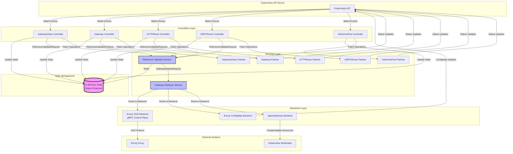
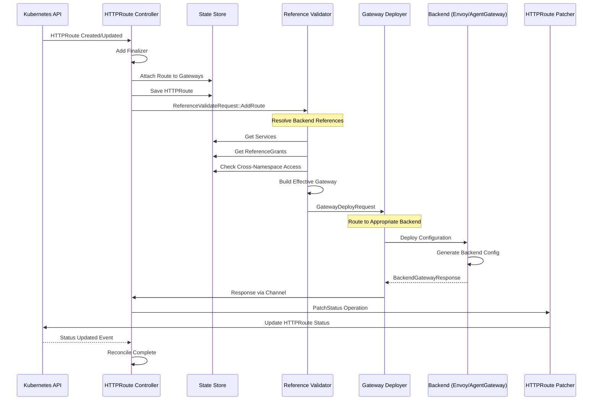
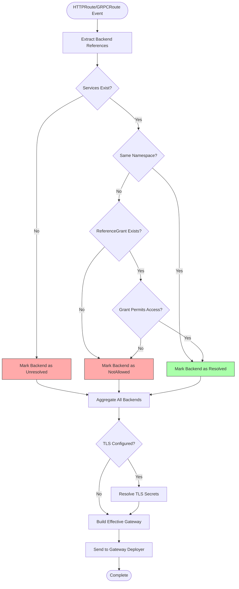
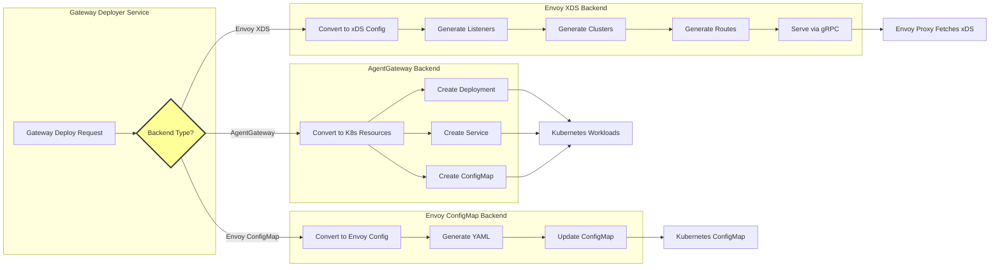
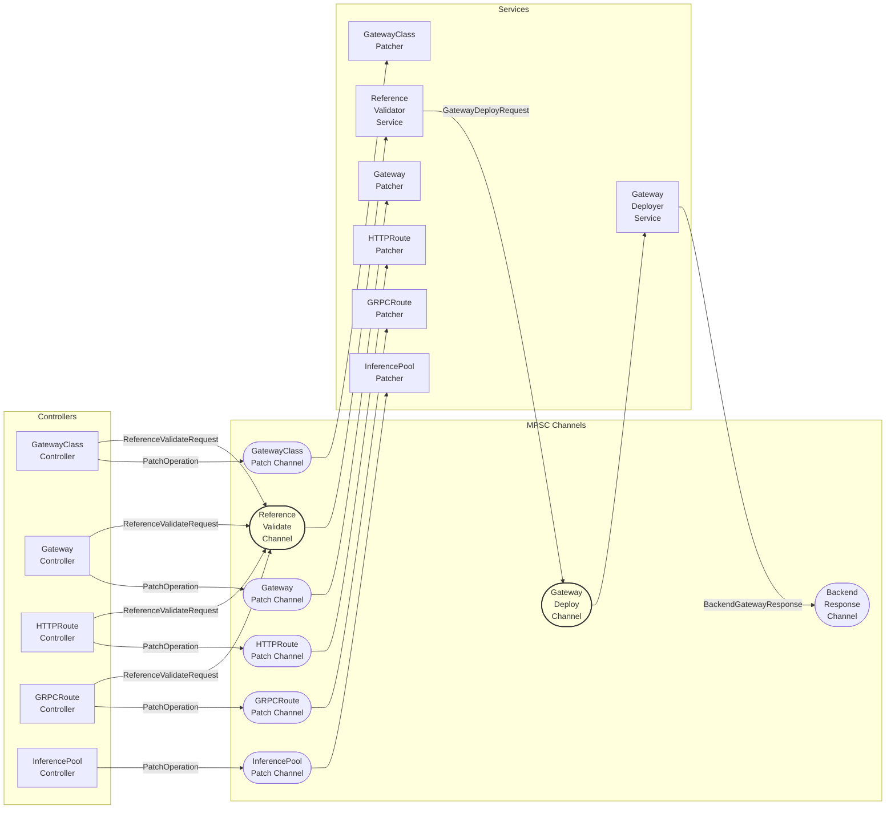
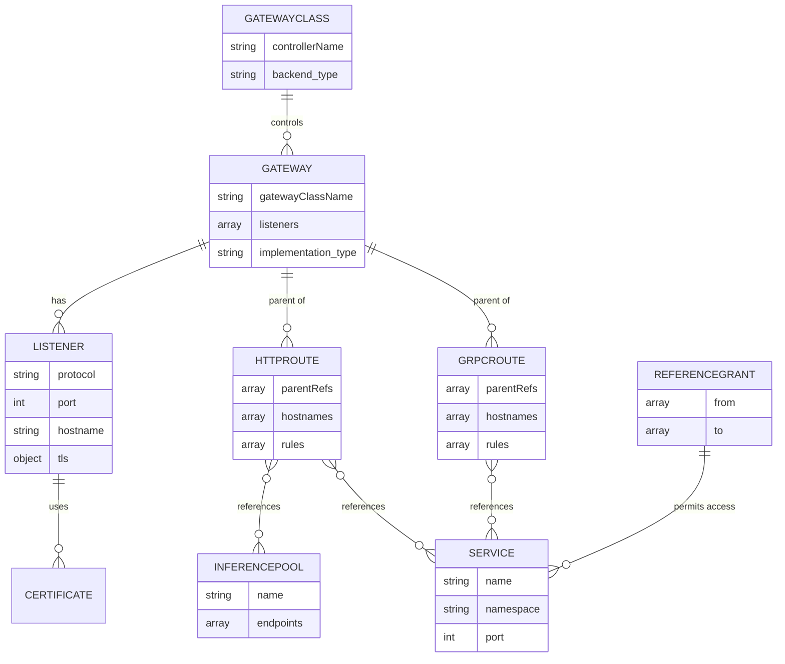
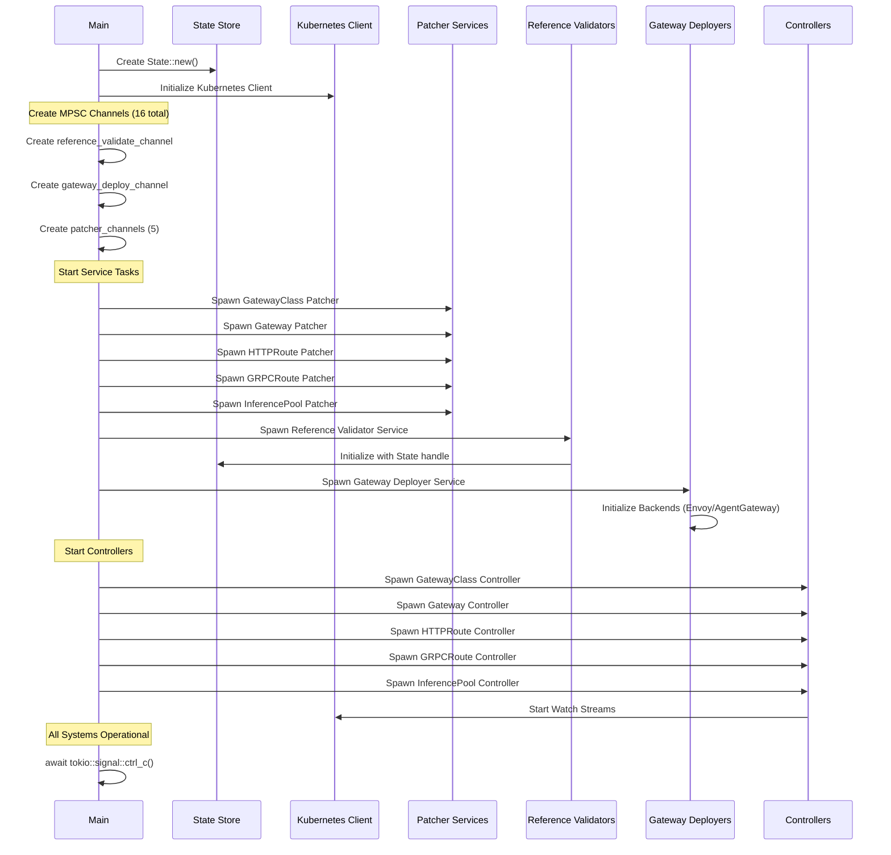

# Kubvernor Architecture Diagrams

## 1. High-Level Component Architecture

## 2. HTTPRoute Processing Data Flow

## 3. Reference Validation Flow

## 4. Backend Selection and Deployment

## 5. State Management Architecture

```mermaid
graph TD
    subgraph "State Store (Arc<Mutex<HashMap>>)"
        GWC_STATE[GatewayClass Storage]
        GW_STATE[Gateway Storage]
        HTTP_STATE[HTTPRoute Storage]
        GRPC_STATE[GRPCRoute Storage]
        IP_STATE[InferencePool Storage]
        GW_ROUTES[Gateway-Route Mappings]
        GW_TYPES[Gateway Implementation Types]
    end

    subgraph "Controllers (Write Access)"
        CTRL1[GatewayClass Controller]
        CTRL2[Gateway Controller]
        CTRL3[HTTPRoute Controller]
        CTRL4[GRPCRoute Controller]
        CTRL5[InferencePool Controller]
    end

    subgraph "Services (Read Access)"
        SRV1[Reference Validator]
        SRV2[Gateway Deployer]
        SRV3[Route Listener Matcher]
    end

    CTRL1 -->|save_gateway_class| GWC_STATE
    CTRL1 -->|save_gateway_type| GW_TYPES
    CTRL2 -->|save_gateway| GW_STATE
    CTRL3 -->|save_http_route| HTTP_STATE
    CTRL3 -->|attach_http_route_to_gateway| GW_ROUTES
    CTRL4 -->|save_grpc_route| GRPC_STATE
    CTRL5 -->|save_inference_pool| IP_STATE

    SRV1 -.->|get_gateway| GW_STATE
    SRV1 -.->|get_http_routes| HTTP_STATE
    SRV1 -.->|get_gateway_type| GW_TYPES
    SRV2 -.->|get_gateway| GW_STATE
    SRV2 -.->|get_http_routes_attached_to_gateway| GW_ROUTES
    SRV3 -.->|get_http_routes_attached_to_gateway| GW_ROUTES

    style GWC_STATE fill:#e6f3ff,stroke:#333
    style GW_STATE fill:#e6f3ff,stroke:#333
    style HTTP_STATE fill:#e6f3ff,stroke:#333
    style GRPC_STATE fill:#e6f3ff,stroke:#333
    style IP_STATE fill:#e6f3ff,stroke:#333
```

## 6. Channel-Based Communication Architecture

## 7. Gateway API Resource Relationships

## 8. Startup and Initialization Sequence

## Key Architectural Principles

1. **Separation of Concerns**: Controllers handle Kubernetes reconciliation, Services handle business logic, Backends handle implementation details
2. **Channel-Based Decoupling**: MPSC channels provide async, non-blocking communication between components
3. **State Centralization**: Single source of truth for runtime state with mutex-protected access
4. **Plugin Architecture**: Multiple backend implementations (Envoy XDS, Envoy ConfigMap, AgentGateway) via trait abstraction
5. **Idempotent Operations**: All operations are designed to be safely retried
6. **Graceful Degradation**: Errors result in status updates and requeue, not crashes
