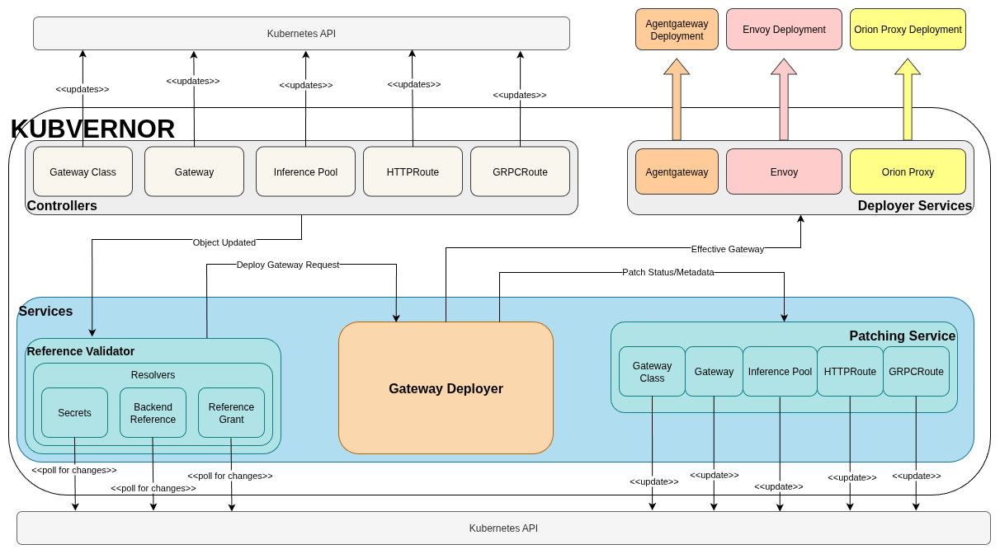

<p align="center">

</p>

# Kubvernor 
Generic Gateway API Manager for Kubernetes

>[!CAUTION]
This project is still very unstable and not ready for use in production environments.

Kubvernor is a Rust implementation of Kubernetes Gateway APIs. The aim of the project is to be as generic as possible so Kubvernor could be used to manage/deploy different gateways (Envoy, Nginx, HAProxy, etc.)


## Architecture 

Objectives:
* Kubvernor should be proxy agnostic and should be capable of deploying different types of proxies (such as Envoy, Agentgateway or others). 
* The architecture should be scalable and flexible. Kubvernor re-calculates the deployment based on clearly documented events (object has changed, references have changed, etc..) which will impact how the gateway is deployed and configured.
* Deployer services responsible for deploying and configuring actual proxies are isolated from all other components and communicate with other components via a well-defined API.



## Prerequisites

0. Install Rust, Docker and Kind, Helm ...

1. Deploy your cluster
```bash
curl --proto '=https' --tlsv1.2 -sSf https://raw.githubusercontent.com/kubernetes-sigs/gateway-api/refs/heads/main/hack/implementations/common/create-cluster.sh | bash
```
2. Run scipt to apply necessary CDRs, configure and run Kubvernor in Kind Cluster
```bash
./scripts/deploy_kubvernor.sh
```
3. All is well if you see a pod in running state
```bash
kubectl get pod -n kubvernor
```

## Run Hello World Gateway API!

This should deploy three different gateways using Envoy Proxy, Agentgateway and Orion Proxy

1.  Deploy hello world... two gateways, two http routes, one backend
```bash
kubectl apply -f kubernetes/kubvernor-hello-world.yaml
```
2. Check that all is well
```bash
kubectl get gateway
```
3. Make some requests
```bash
curl -vki -H 'Host: service-one.com' http://GATEWAY_ADDRESS:1080/data
```

## Run Hello World Gateway API Inference Extension!
1. Using more or less the steps documented [here](https://gateway-api-inference-extension.sigs.k8s.io/guides/#__tabbed_1_3)

```bash
kubectl apply -f https://raw.githubusercontent.com/kubernetes-sigs/gateway-api-inference-extension/refs/tags/v1.1.0/config/manifests/vllm/sim-deployment.yaml
helm install vllm-llama3-8b-instruct  --set inferencePool.modelServers.matchLabels.app=vllm-llama3-8b-instruct  --set inferencePool.image.pullPolicy=IfNotPresent --set inferenceExtension.image.pullPolicy=IfNotPresent --version v1.1.0  oci://registry.k8s.io/gateway-api-inference-extension/charts/inferencepool
```

2. Deploy Gateway API Inference Extension Routes
```bash
kubectl apply -f kubernetes/kubvernor-hello-inference-world.yaml
```

3. Make some requests
```bash
curl -vki http://GATEWAY_ADDRESS:1080/v1/chat/completions   --header 'Host: www.inference-one.com' -H "Content-Type: application/json"   -d '{"model":"meta-llama/Llama-3.1-8B-Instruct", "messages": [{"role":"user", "content":"What is the story?"}]}'
```

## Cleanup
```bash
scripts/clear_kind.sh
```


## Gateway API Conformance Reports
[1.2.1](./conformance/kubvernor-conformance-output-1.2.1.yaml)
[1.2.0](./conformance/kubvernor-conformance-output-1.2.0.yaml)
